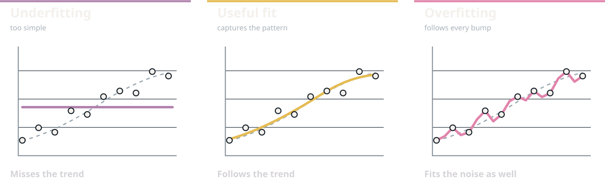
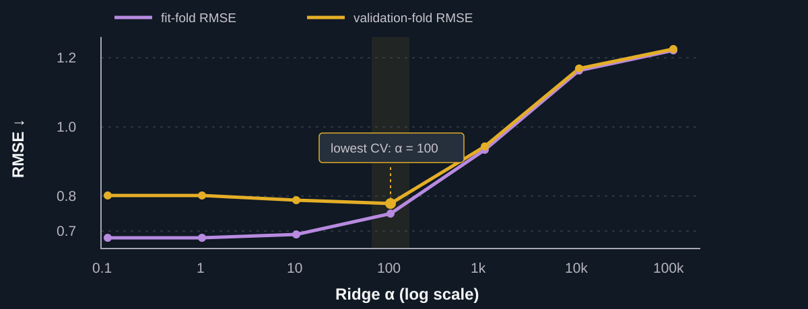
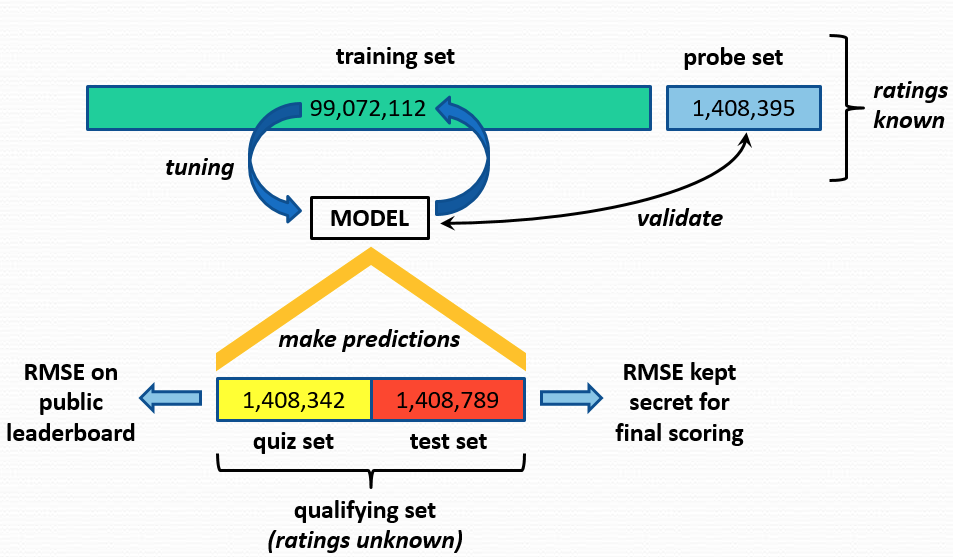

## Generalization {.section-break .generalization-section}

<div class="section-number">01</div>

<p>A model can fit its training data beautifully and still fail on new examples.</p>

## Three familiar models make different assumptions {.detail-slide .model-spectrum-slide}

<div class="model-spectrum">
<div class="spectrum-axis"><span>fewer learned values</span><i></i><span>more stored detail</span></div>
<div class="spectrum-card simple-model fragment fade-up" data-fragment-index="1">
<span>SIMPLE</span><b>Global mean</b><p>Use one learned number for every user–item pair.</p><div class="spectrum-formula">$$\widehat r_{ui}=\mu$$</div>
</div>
<div class="spectrum-card useful-model fragment fade-up" data-fragment-index="2">
<span>MORE STRUCTURE</span><b>Three-mean average</b><p>Average global, user, and item means, with fallback for missing IDs.</p><em>personalization without storing every answer</em>
</div>
<div class="spectrum-card memory-model fragment fade-up" data-fragment-index="3">
<span>MAXIMUM DETAIL</span><b>Memorization + fallback</b><p>Store every observed rating; use the global mean for an unseen pair.</p><em>perfect recall of the training rows</em>
</div>
</div>

<p class="ml-takeaway fragment" data-fragment-index="4">A model that remembers more can reduce <b>training error</b>. That alone does not tell us which model predicts unseen pairs best.</p>

::: {.notes}
[Teaching]
- These are deliberately familiar recommender examples. No new prediction algorithm is needed to motivate validation.
- Memorization is a thought experiment: for a pair already in the training triples, return its stored rating exactly.
:::

## Memorization wins on the training ratings {.detail-slide .memorization-slide}

<div class="memorization-layout">
<div class="memory-triples">
<span>TRAINING TRIPLES</span>
<div class="memory-row memory-head"><b>user</b><b>item</b><b>rating</b></div>
<div class="memory-row"><i>$u_1$</i><i>$i_2$</i><i>4</i></div>
<div class="memory-row"><i>$u_2$</i><i>$i_1$</i><i>5</i></div>
<div class="memory-row"><i>$u_1$</i><i>$i_4$</i><i>2</i></div>
</div>
<i class="memory-arrow fragment" data-fragment-index="1">store exact answers →</i>
<div class="memory-lookups fragment fade-left" data-fragment-index="1">
<span>LOOKUP ON SEEN PAIRS</span>
<div><b>$(u_1,i_2)$</b><i>→</i><em>$\widehat r=4$</em></div>
<div><b>$(u_2,i_1)$</b><i>→</i><em>$\widehat r=5$</em></div>
<div><b>$(u_1,i_4)$</b><i>→</i><em>$\widehat r=2$</em></div>
<strong class="fragment" data-fragment-index="2">training RMSE = 0</strong>
</div>
</div>

<div class="unseen-pair fragment fade-up" data-fragment-index="3">
<span>NOW PREDICT A NEW PAIR</span><b>$(u_4,i_7)$</b><i>→</i><strong>$\mu$</strong><p>No stored answer: fall back to the global mean.</p>
</div>

<p class="ml-takeaway fragment" data-fragment-index="4"><b>Perfect reconstruction is not generalization:</b> the training rows cannot reveal how the lookup rule behaves on a new pair.</p>

## Model selection needs fresh known ratings {.detail-slide .fresh-ratings-slide}

<div class="fresh-ratings-flow">
<div class="fresh-fit">
<span>FIT</span><b>training triples</b><p>learn the global mean, user/item summaries, or stored lookup table</p>
</div>
<i class="fragment" data-fragment-index="1">produce candidate predictors →</i>
<div class="candidate-stack fragment fade-up" data-fragment-index="1">
<div>global mean</div><div>three-mean average</div><div>memorization + fallback</div>
</div>
<i class="fragment" data-fragment-index="2">predict →</i>
<div class="fresh-probe fragment fade-left" data-fragment-index="2">
<span>FRESH PAIRS</span><b>ratings known to us</b><p>but never shown while fitting the candidates</p>
</div>
</div>

<div class="score-contrast fragment fade-up" data-fragment-index="3">
<div><span>TRAINING RMSE</span><b>Can it reconstruct ratings it learned from?</b></div>
<div><span>VALIDATION RMSE</span><b>Can it predict held-out ratings?</b></div>
</div>

<p class="ml-takeaway fragment" data-fragment-index="4">We call those fresh, scored rows the <b>validation set</b>. They let us compare candidates before the final test.</p>

## Train and validation reveal model fit {.detail-slide .fit-patterns-slide}

<div class="fit-patterns" role="table" aria-label="Qualitative training and validation error patterns for three recommender models">
<div class="fit-pattern pattern-head" role="row"><span>candidate</span><span>training RMSE</span><span>validation RMSE</span><span>diagnosis</span></div>
<div class="fit-pattern fragment fade-up" data-fragment-index="1" role="row"><b>global mean</b><span><i class="error-bar high"></i>high</span><span><i class="error-bar high"></i>high</span><strong>underfitting</strong></div>
<div class="fit-pattern useful-pattern fragment fade-up" data-fragment-index="2" role="row"><b>three-mean average</b><span><i class="error-bar medium"></i>lower</span><span><i class="error-bar low"></i>lowest</span><strong>useful fit</strong></div>
<div class="fit-pattern fragment fade-up" data-fragment-index="3" role="row"><b>memorization + fallback</b><span><i class="error-bar zero"></i>zero</span><span><i class="error-bar high"></i>high</span><strong>overfitting</strong></div>
</div>

<div class="fit-definitions fragment fade-up" data-fragment-index="4">
<p><b>Underfitting</b><span>The model misses useful patterns in both training and validation data.</span></p>
<p><b>Overfitting</b><span>The model learns training details that do not transfer to held-out ratings.</span></p>
</div>

<p class="ml-takeaway fragment" data-fragment-index="5">Validation turns “fits the data” into the question we actually care about: <b>does the learned pattern transfer?</b></p>

::: {.notes}
[Teaching]
- The RMSE labels are qualitative; they show the diagnostic pattern rather than claiming a benchmark value.
- The middle row represents a reasonable baseline candidate, not a universal winner on every dataset.
:::

## Three fits to the same noisy data {.detail-slide .fit-noise-slide}

<div class="fit-noise-legend"><span><i class="observed-mark"></i> noisy training observations</span><span><i class="trend-mark"></i> underlying trend (shown for illustration)</span></div>



<p class="ml-takeaway">The overfit curve learns the <b>noise around the trend</b>. Those deviations may not repeat on new data.</p>

::: {.notes}
[Teaching]
- Hold the observations fixed while comparing the three fitted curves. The dashed trend is visible only because this is a schematic example; with real data, we do not know it.
- The flat fit misses the trend. The smooth fit captures it without matching every observation. The jagged fit has near-zero training error but follows noise.
- Link this picture back to the preceding training-versus-validation RMSE table.
:::

## Model selection with Ridge regression {.section-break .selection-section}

<div class="section-number">02</div>

<p>Keep the prediction rule fixed; use validation to choose the penalty strength.</p>

## Ridge regression: four questions {.detail-slide .ridge-template-slide}

<div class="ridge-intro">Return to the California housing model from ML I. <code>Ridge(alpha=...)</code> adds a penalty on large coefficients.</div>

<div class="ridge-questions">
<div><span>1 · MODEL</span><div class="ridge-main-formula">$\widehat y=b+x^{\mathsf T}w$</div><p>Predict from the feature values.</p></div>
<div><span>2 · HYPERPARAMETER</span><div class="ridge-main-formula">$\alpha\geq 0$</div><p>Choose the penalty strength before fitting.</p></div>
</div>

<div class="ridge-objective">
<span>3 · FITTING CRITERION</span>
$$\min_{b,w}\;\sum_{i=1}^{n}\bigl(y_i-b-x_i^{\mathsf T}w\bigr)^2+\alpha\lVert w\rVert_2^2$$
<p>Fit the training rows; penalize the coefficients $w$, not the intercept $b$.</p>
</div>

<div class="ridge-learned"><span>4 · LEARNED PARAMETERS</span><b>$\widehat b,\widehat w$</b><p>After <code>fit</code>: <code>intercept_</code> and <code>coef_</code>.</p></div>

::: {.notes}
[Teaching]
- Reuse the four-question template from ML I. Ridge has the same prediction rule as LinearRegression; only its fitting criterion changes.
- Alpha is set before each fit. Coefficients and intercept are learned separately for each alpha from the fitting rows.
- The objective is the training criterion. Held-out RMSE is used later to choose alpha; it is not added to this objective.

[Sources]
- Ridge objective, alpha, fitted attributes: https://scikit-learn.org/stable/modules/generated/sklearn.linear_model.Ridge.html.
:::

## What does $\alpha$ change? {.detail-slide .ridge-alpha-slide}

<div class="ridge-alpha-spectrum">
<div><span>$\alpha=0$</span><b>No penalty</b><p>The fitting objective becomes ordinary least squares. Coefficients may follow training noise.</p></div>
<div><span>moderate $\alpha$</span><b>Some shrinkage</b><p>Smaller coefficients can improve prediction on new rows.</p></div>
<div><span>large $\alpha$</span><b>Strong shrinkage</b><p>Too much penalty can miss useful relationships.</p></div>
</div>

<div class="ridge-alpha-rule">We do not know the best $\alpha$ from the training loss alone. <b>Compare held-out RMSE.</b></div>

::: {.notes}
[Teaching]
- This is a qualitative pattern, not a guarantee that the middle setting wins on every dataset.
- At alpha zero the fitting objective is ordinary least squares. In scikit-learn, use LinearRegression for an actual unpenalized fit rather than Ridge(alpha=0).

[Sources]
- Alpha and zero-penalty guidance: https://scikit-learn.org/stable/modules/generated/sklearn.linear_model.Ridge.html.
:::

## Holdout validation chooses $\alpha$ {.detail-slide .holdout-slide}

<div class="netflix-holdout">
<div class="holdout-part train-part"><span>FIT SPLIT</span><b>fit Ridge for each $\alpha$</b><p>learn a new $\widehat b$ and $\widehat w$ each time</p></div>
<i class="fragment" data-fragment-index="1">predict held-out rows</i>
<div class="holdout-part valid-part fragment fade-left" data-fragment-index="1"><span>VALIDATION SPLIT</span><b>compare RMSE</b><p>score each fitted Ridge model without refitting it</p></div>
</div>

<div class="candidate-race">
<div class="fragment fade-up" data-fragment-index="2"><span>$\alpha=0.1$</span><b>higher validation RMSE</b></div>
<div class="fragment fade-up winner" data-fragment-index="3"><span>$\alpha=1$</span><b>lowest validation RMSE</b></div>
<div class="fragment fade-up" data-fragment-index="4"><span>$\alpha=100$</span><b>higher validation RMSE</b></div>
</div>

<p class="ml-takeaway fragment" data-fragment-index="5">In this illustration, choose $\alpha=1$. These rankings are schematic; the best value depends on the data.</p>

::: {.notes}
[Teaching]
- This is a schematic comparison, not a measured benchmark. Each alpha needs a fresh fit on the same fitting rows.
- The validation labels choose alpha. They must not be used to fit its coefficients. Keep final test labels outside the comparison.
- This Ridge example follows the same fit/validation distinction introduced with the rating baselines.
:::

## One validation split can give a noisy ranking {.detail-slide .split-instability-slide}

<div class="split-comparison">
<div>
<span>SPLIT A</span>
<div class="split-strip"><i></i><i></i><i></i><i class="valid"></i></div>
<b>best: $\alpha=0.1$</b>
<p>one held-out sample favors weaker shrinkage</p>
</div>
<div>
<span>SPLIT B</span>
<div class="split-strip"><i class="valid"></i><i></i><i></i><i></i></div>
<b>best: $\alpha=1$</b>
<p>another sample favors stronger shrinkage</p>
</div>
</div>

<div class="instability-cause">
<p><b>One validation sample</b><span>the score depends on which rows were held out</span></p>
<p><b>One $\alpha$ ranking</b><span>a close comparison may reverse on another sample</span></p>
<p class="fragment"><b>Natural extension</b><span>let every block take a turn as the validation set</span></p>
</div>

## K-fold CV rotates the validation role {.detail-slide .kfold-slide}

<div class="kfold-animation" role="img" aria-label="Five cross-validation rounds, each with one validation fold and four fitting folds">
<div class="fold-row fragment fade-up" data-fragment-index="1"><span>ROUND 1</span><i class="valid">VALID</i><i>FIT</i><i>FIT</i><i>FIT</i><i>FIT</i><b>RMSE<sub>1</sub></b></div>
<div class="fold-row fragment fade-up" data-fragment-index="2"><span>ROUND 2</span><i>FIT</i><i class="valid">VALID</i><i>FIT</i><i>FIT</i><i>FIT</i><b>RMSE<sub>2</sub></b></div>
<div class="fold-row fragment fade-up" data-fragment-index="3"><span>ROUND 3</span><i>FIT</i><i>FIT</i><i class="valid">VALID</i><i>FIT</i><i>FIT</i><b>RMSE<sub>3</sub></b></div>
<div class="fold-row fragment fade-up" data-fragment-index="4"><span>ROUND 4</span><i>FIT</i><i>FIT</i><i>FIT</i><i class="valid">VALID</i><i>FIT</i><b>RMSE<sub>4</sub></b></div>
<div class="fold-row fragment fade-up" data-fragment-index="5"><span>ROUND 5</span><i>FIT</i><i>FIT</i><i>FIT</i><i>FIT</i><i class="valid">VALID</i><b>RMSE<sub>5</sub></b></div>
</div>

<div class="kfold-mean fragment fade-in" data-fragment-index="6">
$$\mathrm{CV\ RMSE}=\frac{1}{5}\sum_{j=1}^{5}\mathrm{RMSE}_j$$
<p>For each $\alpha$, fit Ridge five times and average its validation RMSE. Choose $\alpha$ using these averages.</p>
</div>

::: {.notes}
[Sources]
- Cross-validation process: https://scikit-learn.org/stable/modules/cross_validation.html.

[Teaching]
- Present K-fold CV as repeated holdout validation. The only new idea is rotating which block plays the validation role.
- For every alpha, repeat all five fitting rounds. Keep the same folds across candidate alpha values so their scores are comparable.
- The secret test set stays outside CV.
:::

## After validation, refit and test once {.detail-slide .refit-slide}

<div class="refit-animation">
<div class="refit-top">
<div><span>FITTING ROUNDS</span><b>fit Ridge for each $\alpha$</b></div>
<div><span>HOLDOUT OR CV SCORES</span><b>select $\alpha$</b></div>
</div>
<i class="fragment" data-fragment-index="1">selection finished</i>
<div class="refit-full fragment fade-up" data-fragment-index="1"><span>ALL DEVELOPMENT DATA</span><b>refit Ridge with that $\alpha$</b><p>learn new coefficients from every development row</p></div>
<i class="fragment" data-fragment-index="2">evaluate once</i>
<div class="refit-test fragment fade-up" data-fragment-index="2"><span>TEST</span><b>final RMSE</b><p>no more model changes afterward</p></div>
</div>

<p class="ml-takeaway">More fitting data helps <b>after</b> the model choice has been made.</p>

::: {.notes}
[Teaching]
- Whether selection used holdout or CV, refit only after alpha is chosen. The coefficients in the final model differ from those in individual folds.
- Keep final test labels out of both selection and refitting.
- The next two slides show how `GridSearchCV` performs the candidate comparisons and final refit in sklearn.
:::

## GridSearchCV puts the CV loop in sklearn {.detail-slide .code-slide .ridge-grid-setup-slide}

:::: {.ridge-grid-layout}
::: {.ridge-grid-code}
```python
from sklearn.linear_model import Ridge
from sklearn.model_selection import GridSearchCV

search = GridSearchCV(
    estimator=Ridge(),
    param_grid={"alpha": [0.1, 1, 100]},
    scoring="neg_root_mean_squared_error",
    cv=5,
    refit=True,
)
search.fit(X_train_housing, y_train_housing)
```
:::

::: {.ridge-grid-reading}
<div><span>MODEL</span><b><code>Ridge()</code></b><p>Fit a fresh Ridge model on the fitting rows of each fold.</p></div>
<div><span>CANDIDATES</span><b>three $\alpha$ values</b><p><code>param_grid</code> lists the settings we want to compare.</p></div>
<div><span>SELECTION</span><b>five-fold RMSE</b><p><code>fit</code> compares all candidates, selects one, then refits it on all training rows.</p></div>
:::
::::

::: {.notes}
[Teaching]
- The housing arrays `X_train_housing` and `y_train_housing` come from ML I. The held-out housing test arrays do not enter this call.
- This uses the same `Ridge` estimator students just saw. `alpha` is a constructor setting, so `param_grid` can name it directly.
- `GridSearchCV` tries three alpha values on five folds: 15 fold fits, followed by one final refit. The default `refit=True` is written explicitly to connect with the preceding slide.
- sklearn scorers are maximized, so negative RMSE is used here. Explain the sign on the next slide.

[Sources]
- GridSearchCV arguments, cross-validation, and refit: https://scikit-learn.org/stable/modules/generated/sklearn.model_selection.GridSearchCV.html.
- Scorer name: https://scikit-learn.org/stable/modules/model_evaluation.html#scoring-string-names.
:::

## Read the selected Ridge model {.detail-slide .code-slide .ridge-grid-result-slide}

<div class="ridge-grid-results">
<div><span>CHOSEN SETTING</span><b><code>best_params_</code></b><p>Which candidate $\alpha$ won?</p></div>
<div><span>CV PERFORMANCE</span><b><code>-best_score_</code></b><p>Change sklearn's negative score back to positive RMSE.</p></div>
<div><span>FINAL FIT</span><b><code>best_estimator_</code></b><p>The selected Ridge model is already refitted on all training rows.</p></div>
</div>

::: {.ridge-grid-result-code}
```python
from sklearn.metrics import root_mean_squared_error

best_alpha = search.best_params_["alpha"]
cv_rmse = -search.best_score_
final_model = search.best_estimator_

test_pred = final_model.predict(X_test_housing)
test_rmse = root_mean_squared_error(y_test_housing, test_pred)
```
:::

<p class="ml-takeaway"><b>Choose with CV, report on test once.</b> Do not call <code>fit</code> again: <code>search.fit(...)</code> already did the final refit.</p>

::: {.notes}
[Teaching]
- Do not claim that a particular alpha wins here; the result comes from running the search on the housing training split.
- `best_score_` is the mean of the best candidate's negative fold RMSE scores. Negating it gives the average fold RMSE shown conceptually on the previous slide.
- `best_estimator_` is a fitted Ridge model because `refit=True`. `search.predict(X_test_housing)` would also work, but the explicit attribute makes the refit step visible.
- The test RMSE is for final evaluation, not another candidate-selection score.

[Sources]
- Fitted attributes and prediction after refit: https://scikit-learn.org/stable/modules/generated/sklearn.model_selection.GridSearchCV.html.
:::

## Diagnose Ridge with fitting and CV error {.detail-slide .ridge-curve-slide}

<p class="ridge-curve-intro">A <b>200-row sample</b> of the housing training data makes the effect visible. Each point averages five fitting or validation folds.</p>



<p class="ml-takeaway">The lowest <b>fitting</b> error is at weak regularization. The lowest <b>CV</b> error among these candidates is at $\alpha=100$.</p>

<p class="source-line">Course housing training data · 200 rows sampled with seed 42 · 5-fold CV · illustrative diagnostic, not the final full-data search</p>

::: {.notes}
[Teaching]
- Ask students to point to the smallest training error, then the smallest validation error. Those are different choices.
- The curves are measured, not schematic. `random.Random(42).sample` selects 200 rows from `dataset/housing/train.csv`; GridSearchCV with five default regression folds and `return_train_score=True` reproduces the plotted values.
- Do not claim alpha 100 is best for the full housing training set. The preceding `ridge_search` uses all training rows for the actual selection.

[Sources]
- `return_train_score` and `cv_results_`: https://scikit-learn.org/stable/modules/generated/sklearn.model_selection.GridSearchCV.html.
:::

## Read the curve before selecting {.detail-slide .ridge-curve-reading-slide}

<div class="ridge-curve-reading">
<div><span>WEAK PENALTY · $\alpha=0.1$</span><b>fit 0.6818 · CV 0.8039</b><p>The fit is better than validation. A low training score alone is not the goal.</p></div>
<div><span>BEST OF THIS GRID · $\alpha=100$</span><b>fit 0.7506 · CV 0.7802</b><p>Sacrificing some fitting accuracy improves validation prediction here.</p></div>
<div><span>TOO STRONG · $\alpha=10{,}000$</span><b>fit 1.1625 · CV 1.1686</b><p>Both errors are high: useful relationships are being suppressed.</p></div>
</div>

<p class="ml-takeaway">A validation curve is a <b>diagnostic for this sample</b>. The full-data search may select another $\alpha$; it must still keep the final test set untouched.</p>

::: {.notes}
[Teaching]
- The values are mean fold RMSE, rounded to four decimals. Training and validation folds have different sample sizes.
- Ask: if the full training set is much larger, must this curve keep the same minimum? No. Use the full-data search for the final alpha.
- This example is evidence for interpreting train/validation gaps, not a claim that CV curves always have a U shape.
:::

## Apply the workflow to rating prediction {.section-break .rating-validation-section}

<div class="section-number">03</div>

<p>The data roles stay the same when we return to user–item ratings.</p>

## Netflix Prize: data roles in practice {.detail-slide .netflix-split-slide}

<div class="netflix-image-layout">
<figure class="netflix-split-figure"></figure>
<div class="netflix-image-reading">
<div><span>KNOWN RATINGS</span><b>Training → fit<br>Probe → validate</b><p>Use these ratings while developing the model.</p></div>
<div><span>PUBLIC FEEDBACK</span><b>Quiz → leaderboard</b><p>Labels are hidden, but the score can influence later choices.</p></div>
<div><span>FINAL CHECK</span><b>Test → final score</b><p>Keep it outside the model-selection loop.</p></div>
</div>
</div>

<p class="source-line">Diagram: <a href="https://pantelis.github.io/cs301/docs/common/lectures/recommenders/netflix/">Pantelis Monogioudis, Netflix Prize lecture notes</a>. Split roles: <a href="https://www2.seas.gwu.edu/~simhaweb/champalg/cf/papers/KorenBellKor2009.pdf">Koren (2009)</a>, Section II.</p>

::: {.notes}
[Teaching]
- Transfer the fit/validation/test roles from Ridge to the Netflix Prize. This is an example of split roles, not a Ridge experiment.
- The image is the same Netflix split diagram used in the baseline lecture. Its training and probe ratings were available during development; quiz and test ratings were hidden.
- Quiz feedback is public, so repeated use can influence model choice. The final test stays outside that loop.

[Sources]
- Diagram: https://pantelis.github.io/cs301/docs/common/lectures/recommenders/netflix/.
- Split roles and public/final score distinction: https://www2.seas.gwu.edu/~simhaweb/champalg/cf/papers/KorenBellKor2009.pdf, Section II.
:::

## For rating data, split pairs before fitting {.detail-slide .rating-cv-slide}

<div class="rating-cv">
<div class="rating-triples">
<span>OBSERVED TRIPLES</span>
<p><b>user</b><b>item</b><b>rating</b></p>
<p><i>u1</i><i>i2</i><i>4</i></p>
<p><i>u2</i><i>i1</i><i>5</i></p>
<p><i>u1</i><i>i4</i><i>2</i></p>
<p><i>u3</i><i>i2</i><i>3</i></p>
</div>
<i class="fragment" data-fragment-index="1">fold</i>
<div class="rating-fold-train fragment fade-up" data-fragment-index="1"><span>FOLD TRAIN</span><b>learn model values</b><p>global mean, user means, or item means from these triples only</p></div>
<i class="fragment" data-fragment-index="2">predict</i>
<div class="rating-fold-valid fragment fade-up" data-fragment-index="2"><span>FOLD VALIDATION</span><b>pairs $(u,i)$ → ratings $\widehat r_{ui}$</b><p>compare with held-out ratings only after prediction</p></div>
</div>

<div class="rating-rule fragment fade-in" data-fragment-index="3"><b>Compute learned quantities after the fold split.</b><span>Computing them earlier leaks validation information into training.</span></div>

::: {.notes}
[Teaching]
- The fold rule applies to both datasets: fit every transformation and learned model value using only that fold's fitting rows.
- For the familiar rating baselines, compute the means from fitting triples only.
:::

## Which future pair are we trying to predict? {.detail-slide .rs-split-questions-slide}

<div class="rs-split-questions">
<div><span>PAIR-LEVEL HOLDOUT</span><b>Usually known IDs, new pair</b><p>Remove selected ratings. Other ratings from these users and items may remain in fitting data.</p><em>Mostly asks: can we predict another interaction?</em></div>
<div><span>USER HOLDOUT</span><b>Entire user is new</b><p>Keep every rating from selected users out of fitting. Their user means cannot be learned.</p><em>Asks: how do we serve a new user?</em></div>
<div><span>ITEM HOLDOUT</span><b>Entire item is new</b><p>Keep every rating for selected items out of fitting. Their item means cannot be learned.</p><em>Asks: how do we serve a new item?</em></div>
</div>

<p class="ml-takeaway">Choose the validation split to match the <b>prediction situation</b>. A random pair split can still contain a few unseen IDs, but it does not deliberately test cold start.</p>

::: {.notes}
[Teaching]
- The words “known” and “new” are always relative to the fitting part of a fold, not the full CSV file.
- Pair-level holdout does not guarantee warm validation rows. Rare users or items may appear only in the held-out rows.
- Whole-user or whole-item holdout is a conceptual split design here; no new sklearn splitter API is required today.

[Source]
- Group-based CV keeps a group entirely in one side of a split: https://scikit-learn.org/stable/modules/cross_validation.html.
:::

## Our pair-level fold is mostly warm {.detail-slide .rs-fold-composition-slide}

<p class="rs-fold-intro">In fold 1 of the course's 0/1 rating data, “known” means the ID appears in the other four fitting folds.</p>

<div class="rs-fold-highlight"><strong>97.1%</strong><span>of validation ratings have both a known user and a known item</span></div>

<table class="rs-fold-counts"><thead><tr><th>validation pair</th><th>count</th><th>specific means available</th></tr></thead><tbody>
<tr><td>known user + known item</td><td>9,934</td><td>user and item</td></tr>
<tr><td>new user + known item</td><td>47</td><td>item only</td></tr>
<tr><td>known user + new item</td><td>251</td><td>user only</td></tr>
<tr><td>new user + new item</td><td>1</td><td>none; use global mean</td></tr>
</tbody></table>

<p class="ml-takeaway">An overall pair-level RMSE is dominated by the warm rows. Report the cold cases separately if new IDs matter to the application.</p>

::: {.notes}
[Teaching]
- Counts come from `dataset/b-rs/train.csv` using the notebook's `random.Random(42)` shuffle and every-fifth-row assignment. Fold 1 has 10,233 validation ratings.
- A pair-level CV scheme happened to create 299 cold validation rows, but their 2.9% share is too small for overall RMSE to describe cold-start quality.
- “Available means” means user/item means learned from fitting rows. The global mean always exists.
:::

## Pick the split before the candidate {.detail-slide .rs-split-choice-slide}

<p class="rs-split-prompt">For each deployment question, which validation design would you use?</p>

<div class="rs-split-choice">
<div><span>A · EXISTING CATALOG</span><b>Will a returning user like another known film?</b><p class="fragment fade-up">Hold out <b>pairs</b>; score predictions for known users and items.</p></div>
<div><span>B · NEW MEMBERS</span><b>What can we recommend before a user has rated anything?</b><p class="fragment fade-up">Hold out entire <b>users</b>; the user-mean path needs a fallback.</p></div>
<div><span>C · NEW FILMS</span><b>How will newly added films perform?</b><p class="fragment fade-up">Hold out entire <b>items</b>; the item-mean path needs a fallback.</p></div>
</div>

<p class="ml-takeaway fragment fade-up">The same three-mean model can receive different scores under these splits because the <b>question changes</b>, not because the formula changes.</p>

::: {.notes}
[Teaching]
- Pause before revealing the answers. Ask which learned mean is unavailable in B and C.
- A whole-user/item holdout may create other cold cases too. If a deployment setting needs both new, define that explicitly.
- This discussion sets up later cold-start models; today's weight selection still uses the stated pair-level folds.
:::

## Three-mean RS: the weights are the choice {.detail-slide .weight-example-slide}

<p class="weight-example-intro">Return to the three-mean predictor from the previous lecture.</p>

<div class="weight-example-formula">
$$
\widehat r_{ui}=w_u\bar r_u+w_i\bar r_i+w_0\mu,
\qquad w_u+w_i+w_0=1
$$
</div>

<div class="weight-example-roles">
<div><span>LEARNED IN EACH FOLD</span><b>Three means</b><p>Compute the global, user, and item means from that fold's fitting ratings. For an unseen ID, use that fold's global mean.</p></div>
<div><span>CHOSEN BY CROSS-VALIDATION</span><b>Three weights</b><p>Try several user / item / global weight triples. Every candidate uses the same five folds.</p></div>
</div>

<p class="ml-takeaway">Only the <b>weights</b> change across candidates. Validation ratings never enter the fitted means.</p>

::: {.notes}
[Teaching]
- Equal weights from the previous lecture are one candidate, not a required choice.
- The mean values are learned separately from each fold's fitting rows. The three weights are hyperparameters selected using validation RMSE.
- If a validation pair has an unseen user or item, replace only the unavailable mean with the global mean from that fold's fitting rows.
:::

## One held-out rating, one weight candidate {.detail-slide .weight-one-row-slide}

<p class="weight-one-row-intro">Course <b>0/1 rating</b> split · fold 1 · validation pair $(u,i)=(987,770)$ · observed rating $r_{ui}=1$</p>

<div class="weight-one-row-fit">
<span>LEARN FROM THE OTHER FOUR FOLDS</span>
<div><b>user mean</b><strong>$\bar r_u=0.5152$</strong></div>
<div><b>item mean</b><strong>$\bar r_i=0.5476$</strong></div>
<div><b>global mean</b><strong>$\mu=0.5739$</strong></div>
</div>

<div class="weight-one-row-predict">
<span>TRY WEIGHTS $(w_u,w_i,w_0)=(0.5,0.3,0.2)$</span>
$$\widehat r_{ui}=0.5(0.5152)+0.3(0.5476)+0.2(0.5739)\approx 0.5366$$
</div>

<div class="weight-one-row-score"><span>VALIDATE</span><b>Compare with $r_{ui}=1$</b><p>Squared error for this row: $(1-0.5366)^2\approx0.2147$</p></div>

<p class="ml-takeaway">Compute RMSE across <b>all validation rows</b> in this fold, then repeat with the other four folds.</p>

::: {.notes}
[Teaching]
- Values come from the first validation row of fold 1 in `dataset/b-rs/train.csv`, using the same Python Random(42) shuffle and every-fifth-index fold assignment as the next slide and ML II notebook.
- User and item means and the global mean were computed from the other four folds only. The validation rating 1 enters the squared error after prediction, not the mean calculation.
- Rounded components are shown for readability; the score table uses full precision. The 0/1 rating scale differs from the earlier Netflix 1–5 star example.
:::

## Five-fold CV compares four weight candidates {.detail-slide .weight-cv-slide}

<p class="weight-cv-intro">For the course's <b>0/1 rating split</b>, repeat that calculation for every held-out pair and candidate. Average each candidate's five fold RMSEs. <b>Lower is better.</b></p>

<table class="weight-cv-table">
<thead><tr><th>Candidate</th><th>User / item / global</th><th>Fold 1</th><th>Fold 2</th><th>Fold 3</th><th>Fold 4</th><th>Fold 5</th><th>CV mean</th></tr></thead>
<tbody>
<tr><th scope="row">Equal</th><td>1/3, 1/3, 1/3</td><td>0.4672</td><td>0.4656</td><td>0.4655</td><td>0.4683</td><td>0.4688</td><td>0.4671</td></tr>
<tr class="weight-cv-winner"><th scope="row">User-heavy</th><td>0.5, 0.3, 0.2</td><td>0.4632</td><td>0.4620</td><td>0.4618</td><td>0.4648</td><td>0.4647</td><td><b>0.4633</b></td></tr>
<tr><th scope="row">Item-heavy</th><td>0.3, 0.5, 0.2</td><td>0.4662</td><td>0.4635</td><td>0.4639</td><td>0.4668</td><td>0.4679</td><td>0.4657</td></tr>
<tr><th scope="row">Global-heavy</th><td>0.2, 0.2, 0.6</td><td>0.4760</td><td>0.4749</td><td>0.4745</td><td>0.4770</td><td>0.4775</td><td>0.4760</td></tr>
</tbody>
</table>

<p class="ml-takeaway"><b>Choose (0.5, 0.3, 0.2) among these four.</b> Recompute the means from all training ratings, combine them with these weights, then test once.</p>

<p class="source-line">Course <code>dataset/b-rs/train.csv</code> · shuffled pair-level 5-fold CV · seed 42 · RMSE rounded to four decimals</p>

::: {.notes}
[Teaching]
- Each row is one hyperparameter candidate, not a different fitting dataset. Keep the five folds fixed when comparing rows.
- The numbers use the 51,161 ratings in `dataset/b-rs/train.csv`. Shuffle row indices with Python's `random.Random(42)` and assign every fifth shuffled index to the same fold. For each fold, recompute the three means from the other four folds and use the fold's global mean for unavailable user/item means. Average the five fold RMSEs without rounding intermediate values.
- The selected weights match the illustrative 0.5 / 0.3 / 0.2 weighting in the previous lecture's notebook. This table supplies the validation step that example deferred.
- “Best” means best of the four listed candidates on these folds; the test ratings are not used for selecting weights.
:::

## How an estimator plugs into sklearn {.detail-slide .sklearn-ecosystem-slide}

<p class="ecosystem-intro">We supply an estimator; sklearn reuses its methods during model selection.</p>

<div class="ecosystem-diagram" role="group" aria-label="Preprocessing produces X and y. GridSearchCV tries settings, fits and predicts with the supplied estimator on each fold, scores validation predictions, and refits the selected estimator.">
<div class="eco-node eco-input"><span>PREPROCESSING</span><b>Prepare <code>X, y</code></b><p>For RS, <code>LabelEncoder</code> maps IDs to lookup positions.</p></div>
<i class="eco-link" aria-hidden="true">→</i>
<div class="eco-search">
<div class="eco-search-heading"><b><code>GridSearchCV</code></b><span>repeats for every candidate and fold</span></div>
<div class="eco-search-flow">
<div class="eco-node eco-choice"><span>SET</span><b><code>alpha</code> or <code>weights</code></b><p>constructor setting</p></div>
<i aria-hidden="true">→</i>
<div class="eco-node eco-estimator"><span>ESTIMATOR SLOT</span><b><code>Ridge</code> or <code>YourRS</code></b><div class="eco-methods"><code>&#95;&#95;init&#95;&#95;(...)</code><code>fit(X_fit, y_fit)</code><code>predict(X_valid)</code></div></div>
<i aria-hidden="true">→</i>
<div class="eco-node eco-score"><span>VALIDATE</span><b>RMSE</b><p>on held-out rows</p></div>
</div>
<div class="eco-search-foot">Compare mean validation RMSE, then refit the winner on all training rows.</div>
</div>
<i class="eco-link" aria-hidden="true">→</i>
<div class="eco-node eco-output"><span>OUTPUT</span><b><code>best_estimator_</code></b><p>Ready for <code>predict(X_test)</code>.</p></div>
</div>

<p class="ml-takeaway"><b>Define <code>YourRS</code> once.</b> With <code>BaseEstimator</code> and the same <code>fit</code> / <code>predict</code> interface, it can use sklearn's CV and search tools.</p>

::: {.notes}
[Teaching]
- This is a synthesis of components already seen: ID encoding from the warm-up and ML I, sklearn-style estimators from ML I, and GridSearchCV from this lecture.
- The highlighted estimator is the interchangeable node. GridSearchCV fits fresh copies on each fitting fold, scores held-out rows, selects constructor settings, and refits the winner. It does not automatically repeat the separate ID encoding step.
- `alpha` belongs to Ridge; `weights` would belong to a weighted three-mean class. `YourRS` is schematic: it could expose `weights` in its constructor, compute user/item/global means in `fit`, and combine them in `predict`. The notebook compares the weights manually so students can see the CV logic first.
- For preprocessing that learns values from training data, the same fold boundary applies: fit it on each fitting fold only. A pipeline would automate that later; it is not needed for today's ID lookup example.

[Sources]
- Custom estimator contract and BaseEstimator parameter methods: https://scikit-learn.org/stable/developers/develop.html.
- GridSearchCV CV and refit behavior: https://scikit-learn.org/stable/modules/generated/sklearn.model_selection.GridSearchCV.html.
:::

## The complete workflow {.detail-slide .final-workflow-slide}

<div class="final-workflow" role="img" aria-label="Complete machine learning workflow from defining a task through cross-validation, refitting, test prediction, and reporting">
<div class="final-step"><span>01</span><b>Define</b><p>inputs, target, metric</p></div>
<i>→</i>
<div class="final-step"><span>02</span><b>Develop</b><p>fit candidate estimators</p></div>
<i>→</i>
<div class="final-step"><span>03</span><b>Validate</b><p>holdout or cross-validation</p></div>
<i>→</i>
<div class="final-step"><span>04</span><b>Refit</b><p>best choice on all development data</p></div>
<i>→</i>
<div class="final-step test-step"><span>05</span><b>Test once</b><p>predict and report RMSE</p></div>
</div>

<div class="closing-principles">
<p><span>FIT</span><b>learns from known answers</b></p>
<p><span>VALIDATE</span><b>chooses without touching test</b></p>
<p><span>TEST</span><b>checks the final frozen workflow</b></p>
</div>

<p class="closing-line">Next: use the same workflow to develop matrix factorization models.</p>

::: {.notes}
[Teaching]
- Ask students to map Ridge alpha and three-mean weights onto each of the five visible steps.
:::
