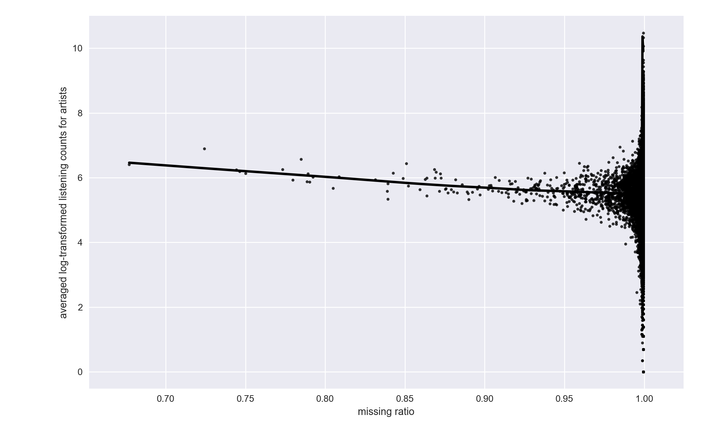

## Start with the MF prediction rule {.lesson-slide}

$$\widehat r_{ui}=p_u^\top q_i$$

USER<b>$p_u\in\mathbb R^K$</b>
A free vector learned for user $u$.

ITEM<b>$q_i\in\mathbb R^K$</b>
A free vector learned for item $i$.

MF fits each user vector using that user's observed ratings. What if a user has very few?

## Histories are uneven {.lesson-slide}

Example from the original LastFM slides: interaction counts are far from uniform.

A short history gives little direct evidence for a free $p_u$; a long history offers much more.

::: {.notes}
The source slides credit: Dai, B., Wang, J., Shen, X., & Qu, A. (2019), Smooth neighborhood recommender systems, JMLR 20. The plot is retained from those slides.
:::

## Define the observed history carefully {.lesson-slide}

$$I_u=\{j:(u,j)\in\Omega_{\mathrm{train}}\},\qquad \tau_u=|I_u|^{-1/2}$$

$I_u$<b>items in user $u$'s history</b>
Only training interactions enter this set.

$\tau_u$<b>history-size normalization</b>
Scales the sum so a long history does not automatically dominate.

When we validate or test, we construct $I_u$ from the training fold—never from held-out ratings.

## Build a user vector from the items {.lesson-slide}

$$h_u=\tau_u\sum_{j\in I_u}w_j,\qquad w_j\in\mathbb R^K$$

rated/visited items $I_u$
<i>→</i>
learned vectors $w_j$
<i>→</i>
sum and scale $h_u$

The presence of an item contributes $w_j$. Its rating value is still used in the fitting loss.

## A small history example {.lesson-slide}

Suppose user $u$ has training interactions with items A, B, and C.

$$h_u=\frac{w_{\mathrm A}+w_{\mathrm B}+w_{\mathrm C}}{\sqrt{3}}$$

SHARED SIGNAL<b>same item, same $w_j$</b>
All users who interacted with B share B's learned contribution.

PERSONALIZED MIX<b>different item sets</b>
Different histories add different combinations of vectors.

## History-derived MF: the prediction {.lesson-slide}

$$\widehat r_{ui}=q_i^\top h_u,\qquad h_u=|I_u|^{-1/2}\sum_{j\in I_u}w_j$$

REPLACE<b>free $p_u$ → history-derived $h_u$</b>
The user representation is now built from learned item-history vectors.

KEEP<b>item factor $q_i$</b>
The prediction is still a dot product.

The original slides call this L-SVD / N-SVD; here we use “history-derived MF” to emphasize its mechanism.

## History-derived MF: four questions {.lesson-slide}

1 · MODEL<b>$q_i^\top h_u$</b>
$h_u$ is the normalized sum of $w_j$ over $I_u$.

2 · HYPERPARAMETERS<b>$K$ and $\lambda$</b>
Choose vector dimension and regularization strength.

3 · FITTING CRITERION<b>squared rating error + penalty</b>
Use only observed training pairs.

4 · LEARNED PARAMETERS<b>$Q$ and $W$</b>
Fit item factors $q_i$ and history contributions $w_j$.

## The fitting criterion {.lesson-slide}

$$\min_{Q,W}\ \sum_{(u,i)\in\Omega_{\mathrm{train}}}(r_{ui}-q_i^\top h_u)^2+\lambda\sum_j\bigl(\|q_j\|_2^2+\|w_j\|_2^2\bigr)$$

$$h_u=|I_u|^{-1/2}\sum_{j\in I_u}w_j$$

Changing $w_j$ affects every training user whose history contains item $j$.

## One block is familiar ridge regression {.lesson-slide}

Fix all history vectors $W$. Then every $h_u$ is a known input vector.

$$\widehat q_i=\arg\min_q\ \sum_{u:(u,i)\in\Omega_{\mathrm{train}}}(r_{ui}-q^\top h_u)^2+\lambda\|q\|_2^2$$

known $h_u$
<i>→</i>
ridge fit for each item $i$
<i>→</i>
updated $q_i$

This is the same fixed-one-side idea used in MF's alternating least squares.

## The history-vector block is coupled {.lesson-slide}

Now fix $Q$. A single $w_j$ appears in many users' sums.

$$j\in I_u\quad\Longrightarrow\quad w_j\text{ contributes to }h_u\text{ and all predictions for }u$$

WHY HARDER?<b>shared contribution</b>
Updating $w_j$ changes several users at once.

PRACTICAL ROUTES<b>coordinate or gradient updates</b>
Hold other vectors fixed, or optimize all vectors with gradients.

## The limit: identical histories {.lesson-slide}

$$I_a=I_b\quad\Longrightarrow\quad h_a=h_b$$

USER A<b>A, B, C</b>
Liked A strongly; disliked C.

USER B<b>A, B, C</b>
Disliked A; liked C strongly.

The two users receive the same history-derived vector even when their rating values differ.

## SVD++ adds a user-specific vector {.lesson-slide}

$$\widehat r_{ui}=q_i^\top\left(p_u+h_u\right),\qquad h_u=|I_u|^{-1/2}\sum_{j\in I_u}w_j$$

$p_u$<b>individual evidence</b>
Learned from user $u$'s rating values.

$h_u$<b>shared history evidence</b>
Built from vectors of items in the training history.

Users A and B can now differ through $p_a$ and $p_b$, even when $I_a=I_b$.

## SVD++: four questions {.lesson-slide}

1 · MODEL<b>$q_i^\top(p_u+h_u)$</b>
A free user factor plus a history-derived factor.

2 · HYPERPARAMETERS<b>$K$ and $\lambda$</b>
Choose factor dimension and penalty strength.

3 · FITTING CRITERION<b>regularized squared error</b>
Compare predictions with training ratings.

4 · LEARNED PARAMETERS<b>$P$, $Q$, and $W$</b>
User factors, item factors, and history contributions.

## SVD++ fitting criterion {.lesson-slide}

$$\min_{P,Q,W}\ \sum_{(u,i)\in\Omega_{\mathrm{train}}}\left[r_{ui}-q_i^\top(p_u+h_u)\right]^2+\lambda\left(\|P\|_F^2+\|Q\|_F^2+\|W\|_F^2\right)$$

$$h_u=|I_u|^{-1/2}\sum_{j\in I_u}w_j$$

This writes the objective as a sum; using mean error would rescale the numerical value of $\lambda$.

## How to fit it {.lesson-slide}

fix $Q,W$ update $P$
<i>→</i>
fix $P,W$ update $Q$
<i>→</i>
fix $P,Q$ update $W$
<i>↺</i>

ALTERNATING VIEW<b>ridge-like blocks</b>
The $P$ and $Q$ blocks are ridge problems when the other vectors are fixed.

GRADIENT VIEW<b>one differentiable loss</b>
SGD or Adam can update $P$, $Q$, and $W$ together.

The learning algorithm is separate from the model formula: the same rule can be fitted in different ways.

## Choose settings without leaking history {.lesson-slide}

training pairs fit $P,Q,W$
<i>→</i>
validation pairs select $K,\lambda$
<i>→</i>
test pairs report once

For each split, construct $I_u$ from its training interactions. A validation/test pair must not reveal itself through the history feature used to predict it.

A completely new user still has neither a fitted $p_u$ nor a nonempty history; SVD++ alone does not solve that cold start.

## Nearby extensions from the original deck {.lesson-slide}

NMF<b>constrain factors</b>
Keep the MF dot product but require $P,Q\geq0$.

GROUP MF<b>add group vectors</b>
Use known user/item groups to share structure.

SMOOTH MF<b>borrow from neighbors</b>
Weight nearby user/item observations during fitting.

Each variant changes a different module: feasible parameters, prediction rule, or fitting criterion.

## Reuse the four questions {.lesson-slide}

<table class="lesson-table"><thead><tr><th></th><th>MF</th><th>History-derived MF</th><th>SVD++</th></tr></thead><tbody>
<tr><td>Model</td><td>$q_i^\top p_u$</td><td>$q_i^\top h_u$</td><td>$q_i^\top(p_u+h_u)$</td></tr>
<tr><td>Learned</td><td>$P,Q$</td><td>$Q,W$</td><td>$P,Q,W$</td></tr>
<tr><td>Hyperparameters</td><td>$K,\lambda$</td><td>$K,\lambda$</td><td>$K,\lambda$</td></tr>
<tr><td>Criterion</td><td colspan="3">regularized error on observed training ratings</td></tr>
</tbody></table>

Adding the history path changes how users are represented; evaluation still follows the same train/validation/test discipline.

