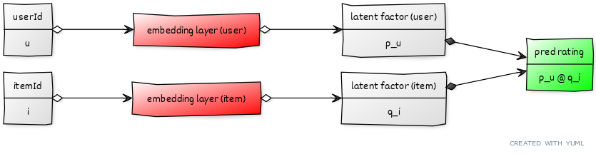
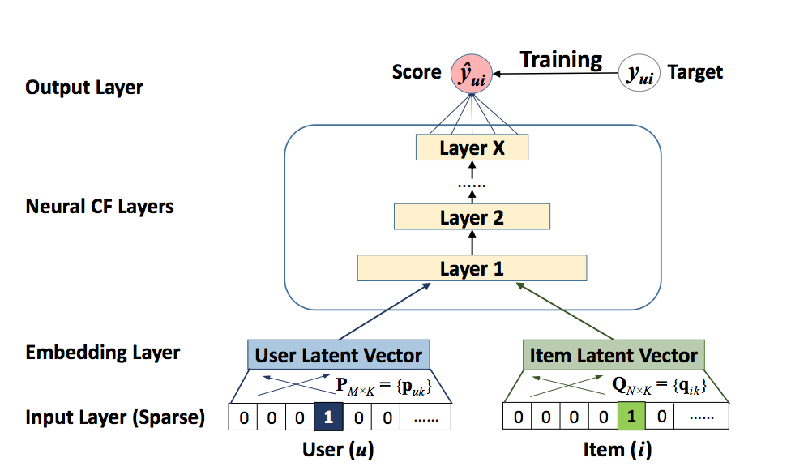

## Can a neural network reproduce MF? {.lesson-slide}

<div class="lesson-formula">$$\widehat r_{ui}=p_u^\top q_i$$</div>

<div class="lesson-flow"><div>user ID $u$</div><i>→</i><div>lookup $p_u$</div><i>↘</i><div>inner product</div><i>→</i><div>rating</div></div>
<div class="lesson-flow"><div>item ID $i$</div><i>→</i><div>lookup $q_i$</div><i>↗</i><div>same output</div></div>

<p class="lesson-takeaway">The first challenge is a reusable layer that turns an ID into its learned factor vector.</p>

## An embedding layer is a learned lookup table {.lesson-slide}

<div class="lesson-grid"><div class="lesson-card"><span>USER TABLE</span><b>$P\in\mathbb R^{n\times K}$</b><p>Integer user ID $u$ selects row $p_u$.</p></div><div class="lesson-card"><span>ITEM TABLE</span><b>$Q\in\mathbb R^{m\times K}$</b><p>Integer item ID $i$ selects row $q_i$.</p></div></div>

<div class="lesson-formula">$$u\longmapsto P[u]=p_u,\qquad i\longmapsto Q[i]=q_i$$</div>

<p class="lesson-takeaway">“Embedding” and “latent factor” describe the same kind of learned dense vector here.</p>

::: {.notes}
[Source] Keras Embedding API: https://keras.io/api/layers/core_layers/embedding/ . It accepts nonnegative integer indices and returns dense vectors.
:::

## Lookup equals a one-hot matrix product {.lesson-slide}

<p class="lesson-lede">With three users, ID 2 can be written as a one-hot row $e_2=(0,1,0)$.</p>

<div class="lesson-formula">$$e_2P=(0,1,0)\begin{bmatrix}p_1^\top\\p_2^\top\\p_3^\top\end{bmatrix}=p_2^\top$$</div>

<div class="lesson-grid"><div class="lesson-card"><span>CONCEPT</span><b>select one row</b><p>The one-hot vector explains the mathematics.</p></div><div class="lesson-card"><span>IMPLEMENTATION</span><b>use a lookup</b><p>An embedding layer retrieves the row without building a huge one-hot array.</p></div></div>

## Embedding size is a choice; values are learned {.lesson-slide}

<div class="lesson-grid"><div class="lesson-card"><span>HYPERPARAMETER</span><b>$K$ · embedding dimension</b><p>Choose how many coordinates each ID receives before fitting.</p></div><div class="lesson-card"><span>LEARNED PARAMETERS</span><b>$P$ and $Q$</b><p>Training updates the $nK+mK$ table entries.</p></div></div>

<div class="lesson-formula compact">$$\texttt{Embedding(input\_dim=n\_users, output\_dim=K)}$$</div>

<p class="lesson-takeaway">The ID numbers are lookup positions, not ordered numerical measurements.</p>

## MF is a tiny two-branch network {.lesson-slide}



<div class="lesson-formula compact">$$u\to p_u,\quad i\to q_i,\quad (p_u,q_i)\to p_u^\top q_i$$</div>

<p class="lesson-takeaway">Turning MF into layers does not change its model: the interaction is still an inner product.</p>

## What changes in NCF? {.lesson-slide}

<div class="lesson-grid"><div class="lesson-card"><span>MATRIX FACTORIZATION</span><b>Fixed interaction</b><div class="lesson-formula compact">$$p_u^\top q_i=\sum_{k=1}^K p_{uk}q_{ik}$$</div></div><div class="lesson-card"><span>NEURAL COLLABORATIVE FILTERING</span><b>Learn a combination rule</b><div class="lesson-formula compact">$$\widehat r_{ui}=g_\theta([p_u,q_i])$$</div></div></div>

<p class="lesson-takeaway">The brackets mean concatenate the two vectors, then pass the result through a network.</p>

::: {.notes}
[Source] The NCF paper replaces the inner product with a neural interaction function: https://arxiv.org/abs/1708.05031 . The original paper studies implicit feedback; this lecture uses a rating-regression adaptation.
:::

## Follow one prediction through the NCF graph {.lesson-slide}

<div class="lesson-flow"><div>$u,i$<br>integer IDs</div><i>→</i><div>$p_u,q_i$<br>embeddings</div><i>→</i><div>$[p_u,q_i]$<br>concatenate</div><i>→</i><div>$g_\theta$<br>hidden layers</div><i>→</i><div>$\widehat r_{ui}$</div></div>



<p class="lesson-takeaway">Every observed rating sends an error signal through the hidden layers and back into the two embedding tables.</p>

## NCF: four questions before code {.lesson-slide}

<div class="lesson-grid"><div class="lesson-card"><span>1 · MODEL</span><b>$g_\theta([p_u,q_i])$</b><p>Two ID lookups followed by a nonlinear network.</p></div><div class="lesson-card"><span>2 · HYPERPARAMETERS</span><b>embedding size + architecture</b><p>Choose $K$, depth, width, activation, and training settings.</p></div><div class="lesson-card"><span>3 · CRITERION</span><b>MSE on observed ratings</b><p>Fit only pairs whose ratings are known in the training fold.</p></div><div class="lesson-card"><span>4 · LEARNED</span><b>tables + network weights</b><p>$P,Q$ and the hidden/output-layer parameters.</p></div></div>

## The rating-regression criterion {.lesson-slide}

<div class="lesson-formula compact">$$\min_{P,Q,\theta}\;\frac{1}{|\Omega_{\rm train}|}\sum_{(u,i)\in\Omega_{\rm train}}\bigl(r_{ui}-g_\theta([p_u,q_i])\bigr)^2+\lambda\,\mathrm{Reg}(P,Q,\theta)$$</div>

<div class="lesson-grid"><div class="lesson-card"><span>FIT</span><b>Training pairs only</b><p>Gradient updates use observed training ratings.</p></div><div class="lesson-card"><span>SELECT</span><b>Validation RMSE</b><p>Choose settings and stopping point without touching the final test labels.</p></div></div>

<p class="lesson-takeaway">This is the explicit-rating version used in STAT3009; the original NCF research also considers implicit feedback.</p>

## A Keras implementation sketch {.lesson-slide .lesson-code}

```python
import keras

user_id = keras.Input(shape=(1,), dtype="int32")
item_id = keras.Input(shape=(1,), dtype="int32")
u = keras.layers.Flatten()(keras.layers.Embedding(n_users, K)(user_id))
i = keras.layers.Flatten()(keras.layers.Embedding(n_items, K)(item_id))
x = keras.layers.Concatenate()([u, i])
x = keras.layers.Dense(32, activation="relu")(x)
rating = keras.layers.Dense(1)(x)
model = keras.Model([user_id, item_id], rating)
model.compile(optimizer="adam", loss="mse")
```

<p class="lesson-takeaway">The two embedding layers and Dense layers are all trained by the same loss.</p>

::: {.notes}
[Sources] Keras Embedding: https://keras.io/api/layers/core_layers/embedding/ ; Keras Model API: https://keras.io/api/models/model/ . This is a structural sketch, not a complete data-loading notebook.
:::

## In-class design: keep the familiar bias terms {.lesson-slide}

<div class="lesson-formula">$$\widehat r_{ui}=\mu+a_u+b_i+p_u^\top q_i$$</div>

<p class="lesson-lede">How would this prediction rule become a computational graph?</p>

<div class="lesson-grid three"><div class="lesson-card"><span>BRANCH 1</span><b>user ID</b><p>Look up $a_u$ and $p_u$.</p></div><div class="lesson-card"><span>BRANCH 2</span><b>item ID</b><p>Look up $b_i$ and $q_i$.</p></div><div class="lesson-card"><span>COMBINE</span><b>sum + dot product</b><p>Add $\mu$, both biases, and $p_u^\top q_i$.</p></div></div>

<p class="lesson-takeaway">A neural framework can implement an existing mathematical model; adding layers is a separate modeling choice.</p>

## Add a nonlinear correction, keep MF {.lesson-slide}

<div class="lesson-formula">$$\widehat r_{ui}=p_u^\top q_i+h_\phi([s_u,t_i])$$</div>

<div class="lesson-grid"><div class="lesson-card"><span>MF PATH</span><b>first-order interaction</b><p>$p_u^\top q_i$ retains the simple, interpretable matching mechanism.</p></div><div class="lesson-card"><span>NEURAL PATH</span><b>additional interaction</b><p>Separate embeddings $s_u,t_i$ feed a nonlinear correction.</p></div></div>

<p class="lesson-takeaway">This additive extension is useful when a dot product captures part of the pattern but leaves structured residuals.</p>

## A more flexible path is optional {.lesson-slide}

<div class="lesson-formula compact">$$\widehat r_{ui}=\phi\!\left([\,p_u\circ q_i,\;\psi([s_u,t_i])\,]\right)$$</div>

<div class="lesson-grid"><div class="lesson-card"><span>$p_u\circ q_i$</span><b>coordinate-wise products</b><p>Keep explicit factor interactions as inputs.</p></div><div class="lesson-card"><span>$\psi,\phi$</span><b>learned nonlinear functions</b><p>Let the network combine those interactions with another representation.</p></div></div>

<p class="lesson-takeaway">This extension has more parameters and more design choices; it needs the same careful validation as simpler models.</p>

## When the ID is new {.lesson-slide}

<div class="lesson-grid"><div class="lesson-card"><span>KNOWN ID</span><b>Embedding row exists</b><p>Look up its learned vector and predict.</p></div><div class="lesson-card"><span>NEW ID</span><b>No learned row yet</b><p>The ID-only NCF model cannot infer a personalized vector from an unseen ID.</p></div></div>

<p class="lesson-takeaway">Side information—user or item features—offers a way to construct a representation for a new entity. That is the next lecture.</p>

## The thread from MF to NCF {.lesson-slide}

<div class="lesson-flow"><div>MF<br><b>dot product</b></div><i>→</i><div>embedding layers<br><b>same factors</b></div><i>→</i><div>NCF<br><b>learned interaction</b></div><i>→</i><div>side information<br><b>new IDs</b></div></div>

<p class="lesson-takeaway">For each new model, ask again: <b>model, hyperparameters, fitting criterion, learned parameters</b>.</p>

