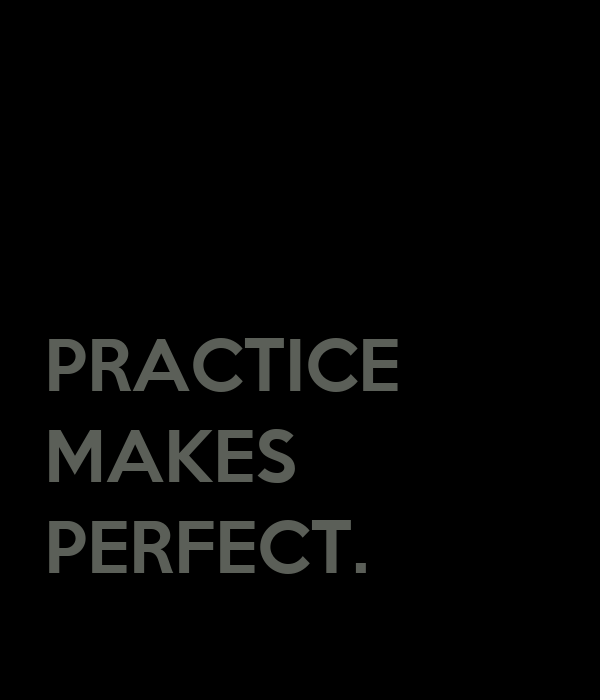
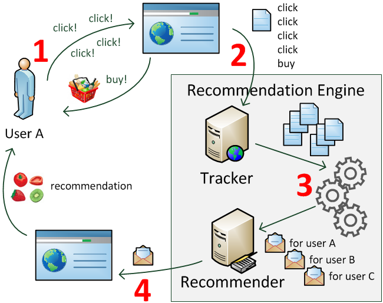

## Every platform chooses what to show next {.word-slide}

<div class="eyebrow">01 · COURSE PURPOSE</div>

<div class="word-wall">
  <span class="word-1">products</span>
  <span class="word-2">music</span>
  <span class="word-3">connections</span>
  <span class="word-4">films</span>
  <span class="word-5">investments</span>
</div>

<p class="aside">AMAZON · ALIBABA · NETFLIX · SPOTIFY · LINKEDIN · FINANCE</p>

<p class="bottom-statement">Recommendation turns many possible choices into a useful next decision.</p>

::: {.notes}
[Sources]
- Application examples and course framing adapted from the user-provided `slides/Lec-overview/S.tex`.
:::

## The semester moves from baselines to neural recommenders {.roadmap-slide}

<div class="eyebrow">COURSE MAP</div>

<div class="course-roadmap">
  <div><span>FOUNDATIONS</span><h3>Frame the problem</h3><p>Interaction data<br>Evaluation<br>Mean baselines</p></div>
  <div><span>LATENT STRUCTURE</span><h3>Learn hidden preferences</h3><p>Cross-validation<br>SVD and matrix factorization<br>MovieLens</p></div>
  <div><span>NEURAL RS</span><h3>Add expressive models</h3><p>Neural networks<br>Neural matrix factorization<br>Side information</p></div>
</div>

<div class="roadmap-dna"><span>STATISTICS</span><b>×</b><span>MACHINE LEARNING</span><b>×</b><span>CODE</span></div>

::: {.notes}
[Sources]
- Course sequence is condensed from the top-level sections of the user-provided `STAT3009_nb/STAT3009_nb_Fall2025.ipynb`.
:::

## How this course works {.section-break .course-section}

<div class="section-number">02</div>

<p>Understand the expectations before we begin the technical work.</p>

::: {.notes}
[Sources]
- Section framing adapted from the teaching modes and assessment design in the user-provided `slides/Lec-overview/S.tex`.
:::

## You will learn, build, and compete {.rhythm-slide}

<div class="rhythm">
  <div><span>01</span><h3>LEARN</h3><p>Concepts in slides and notes</p></div>
  <div><span>02</span><h3>BUILD</h3><p>Live Python in Colab and Jupyter</p></div>
  <div><span>03</span><h3>COMPETE</h3><p>In-class practice and Kaggle</p></div>
</div>

<p class="link-line"><a href="https://www.bendai.org/CUHK-STAT3009/">Course homepage ↗</a><span>·</span><a href="https://github.com/statmlben/CUHK-STAT3009">GitHub repository ↗</a></p>

::: {.notes}
[Sources]
- Teaching modes and links adapted from the user-provided `slides/Lec-overview/S.tex`.
:::

## Bring foundations—not prior recommender-system experience {.split-slide}

:::: {.columns}
::: {.column width="43%"}
<div class="eyebrow">WHAT HELPS</div>

### We build from tools you have already seen

You do not need to arrive as a recommender-systems expert.

Python-library tutorials are provided when we need them.
:::

::: {.column width="51%"}
<div class="rule-list">
  <div><strong>01</strong><span><b>Statistics</b><br>Linear and ridge regression; hypothesis testing</span></div>
  <div><strong>02</strong><span><b>Programming</b><br>Python, NumPy, Pandas, basic scikit-learn</span></div>
  <div><strong>03</strong><span><b>Mathematics</b><br>Linear algebra, calculus, probability</span></div>
</div>
:::
::::

::: {.notes}
[Sources]
- Prerequisites are adapted from the user-provided `slides/Lec-overview/S.tex`.
:::

## Assessment rewards implementation {.assessment-slide}

<div class="assessment">
  <div class="minor"><b>15%</b><span>Homework</span></div>
  <div class="minor"><b>40%</b><span>Open-book<br>in-class Kaggle</span><span class="assessment-timing">Approximately mid-semester</span></div>
  <div class="major"><b>45%</b><span>Final in-class<br>coding quiz</span><span class="assessment-timing">Last class of the semester</span></div>
</div>

::: {.notes}
[Sources]
- Instructor-updated assessment weights and timing: homework 15%; open-book in-class Kaggle 40%, approximately mid-semester; final in-class coding quiz 45%, in the last class of the semester.
:::

## Use AI as a tutor—not a substitute for understanding {.ai-use-slide}

<div class="eyebrow">AI-ASSISTED · STUDENT-OWNED</div>

<div class="ai-contract">
  <div><span>USE IT TO</span><b>Question · compare · debug</b><p>Ask for an explanation of an error, compare two approaches, or improve the clarity of your Markdown.</p></div>
  <div><span>VERIFY IT</span><b>Run · inspect · test</b><p>Execute every cell, read the output, check assumptions, and test the suggestion on the actual data.</p></div>
  <div><span>OWN IT</span><b>Explain · modify · reproduce</b><p>You remain responsible for every submitted result and should be able to adapt the code yourself.</p></div>
</div>

<p class="ai-boundary"><strong>Not evidence of learning:</strong> submitting generated work that you cannot reproduce, justify, or debug.</p>
<p class="ai-disclosure">Follow each assessment’s stated tool and disclosure rules. During an assessment, use only the tools explicitly permitted.</p>

::: {.notes}
[Sources]
- This slide states the course's working principle for responsible AI assistance. Assessment-specific instructions remain authoritative.
:::

## Building a knowledge landscape {.knowledge-landscape-slide}

<p class="foundations-intro">Know where an idea fits, what it depends on, and what you need to learn next.</p>

<table class="knowledge-links" aria-label="Connections between foundational knowledge and recommender-system methods">
<thead><tr><th>Foundation</th><th>Connection in this course</th><th>A question you can ask</th></tr></thead>
<tbody>
<tr><td><strong>Linear algebra</strong><br>Vectors and inner products</td><td>Matrix factorization<br>Represents users and items with vectors</td><td>What does the predicted score represent?</td></tr>
<tr><td><strong>Probability and statistics</strong><br>Sampling and uncertainty</td><td>Model evaluation<br>Uses held-out data as evidence</td><td>Will this result extend to new ratings?</td></tr>
<tr><td><strong>Coding</strong><br>Arrays, indexing, functions</td><td>Computational experiments<br>Turns a model into data operations</td><td>Does the program implement the intended experiment?</td></tr>
</tbody>
</table>

<p class="knowledge-connections">A model needs a representation, an implementation, and evidence about its predictions.</p>

<p class="foundations-takeaway">Use this map to locate an AI suggestion and identify the knowledge you need to use it.</p>

::: {.notes}
Teaching notes:

- 这张知识版图把数学和 coding 的基础概念与课程方法连接起来。学生要逐渐理解概念的位置、依赖关系和适用条件，也要识别自己理解中的空白。
- 例如 AI 建议 matrix factorization：线性代数帮助理解用户和电影的向量表示，coding 帮助实现索引和内积，统计帮助评价对未参与训练的评分的预测能力。
- 这些基础并非各自孤立。研究一个模型时，需要同时考虑它怎样表示数据、怎样计算，以及怎样获得评价证据。
- 遇到陌生术语时，可以先定位，再检查先修概念。知道“训练表现与新数据表现”有区别，才会意识到需要追问评价数据的来源。
- AI 可以辅助解释概念和寻找学习材料。课堂中的推理、小例子和代码修改，让学生逐渐能够自己复述并使用这些关系。
- 不要求一开始精通所有节点。先建立结构，再逐步把关键连接学深。

[Sources]
- The instructor's teaching priority of building a knowledge landscape, connected to the linear algebra, evaluation, and programming topics in this course.
:::

## Mathematics and coding in the AI era {.ai-foundations-slide}

<p class="foundations-intro">Mathematics and coding turn your knowledge landscape into something you can reason with and use.</p>

<div class="foundations-columns">
<div>
<h3>Mathematics</h3>
<p class="foundation-role">Define the problem and judge the evidence.</p>
<ul>
<li>Connect models to their assumptions and objectives.</li>
<li>Understand what an evaluation result supports.</li>
</ul>
<p class="foundation-example">Does a lower rating error imply a better recommendation list?</p>
</div>
<div>
<h3>Coding</h3>
<p class="foundation-role">Understand and adapt the computation.</p>
<ul>
<li>Trace how a modeling idea becomes an experiment.</li>
<li>Modify the workflow when data or requirements change.</li>
</ul>
<p class="foundation-example">Which observations went into fitting and evaluation?</p>
</div>
</div>

<p class="foundations-takeaway">Use these foundations to guide your questions and extend your understanding with AI.</p>

::: {.notes}
Teaching notes:
- 建议讲解约 2 分钟。先承认学生的问题：既然 AI 可以解释公式、写代码，为什么还要学基础？
- 承接上一页：数学和 coding 帮助学生把知识版图中的连接建立起来。通过推导理解假设如何影响结论，通过小规模实验理解数据处理和模型行为。
- 学习目标是形成自己的理解和判断。数学让我们能把“推荐得好”说清楚：预测什么、采用哪些假设、什么结果算证据。Coding 让我们能追踪实际计算，并在数据格式或任务要求改变时调整程序。
- 即使一段 AI 给出的代码完全正确，我们仍需要理解它实现的目标是否适合当前问题。准确实现一个目标，与选择一个合适的目标，是不同的判断。
- 基础知识也让提问更具体。例如“为什么分组后的数组长度变了？”比“代码不对，帮我修”更容易定位问题。学生需要能够根据回答继续检查。
- 本课会练习读懂关键代码、预测小例子的结果，并亲手修改和验证。API 的细节可以查文档，也可以请 AI 解释。
- 本页的两个问题会在后面的评分预测、排序和 held-out evaluation 中再次出现。

[Sources]
- Instructor teaching rationale connecting the course's programming foundations, rating-prediction task, and evaluation examples. No claim about a particular AI system's measured performance is intended.
:::

## Performance on familiar questions {.ai-intuition-slide}

<p class="intuition-scenario">A student can solve every question on the practice sheet.</p>

<p class="intuition-question">What would convince you that they can solve new questions?</p>

<p class="intuition-answer">Try a separate set of questions that was not used for practice.</p>

::: {.notes}
Teaching notes:

- 先让学生讨论十几秒，再解释熟悉练习题与解决新问题之间的区别。此时不需要代码、模型 API 或 RMSE。
- 将这个直观区分放进知识版图的“评价”部分。即使 AI 给出一个很好的分数，我们也需要追问：这是在什么题目上测出来的？
- 在后面的评分预测部分，用训练误差的代码再次回到这个问题。

[Sources]
- Instructor-authored learning analogy introducing the distinction between training fit and generalization.
:::

## The best way to learn code is to wrestle with it {.practice-slide}

<div class="triptych">
  <figure><figcaption>PRACTICE</figcaption></figure>
  <figure><figcaption>DEBUG</figcaption></figure>
  <figure><figcaption>PERSIST</figcaption></figure>
</div>

<p class="practice-line"><strong>Bring a laptop.</strong> Read code, run it, break it, fix it—and make it yours.</p>

::: {.notes}
[Sources]
- Advice and illustrations are from the user-provided `slides/Lec-overview/S.tex` and `figs/` directory.
:::

## Software preparation {.section-break .prep-section}

<div class="section-number">03</div>

<p>Use notebooks to keep executable code and readable reasoning together.</p>

::: {.notes}
[Sources]
- Section framing adapted from cells 0–18 of the user-provided notebook.
:::

## Three layers make a Colab notebook work {.ecosystem-slide}

<div class="eyebrow">ONE COMPUTATIONAL WORKFLOW</div>

<div class="layer-flow">
  <div><span>LANGUAGE</span><b>Python</b><p>The instructions and objects we write.</p></div>
  <i>lives inside</i>
  <div><span>DOCUMENT</span><b>Jupyter Notebook</b><p>An <code>.ipynb</code> file containing code, text, and saved output.</p></div>
  <i>runs through</i>
  <div><span>SERVICE</span><b>Google Colab</b><p>A hosted notebook interface and computational runtime.</p></div>
</div>

<p class="bottom-statement">Colab is based on Jupyter; Python is the primary language executed by its kernel.</p>

::: {.notes}
[Sources]
- Google describes Colab as a hosted Jupyter Notebook service and Jupyter as the open-source project on which Colab is based: https://research.google.com/colaboratory/faq.html.
- Jupyter notebook documents contain executable inputs, outputs, and accompanying narrative text: https://jupyter-notebook.readthedocs.io/.
:::

## A notebook mixes Python and Markdown {.notebook-languages-slide}

:::: {.columns .vcenter}
::: {.column width="43%"}
<div class="eyebrow">JUPYTER NOTEBOOK</div>

<div class="language-list">
  <div><span>PYTHON</span><b>Compute</b><p>Import packages, define objects, run models, and create output.</p></div>
  <div><span>MARKDOWN</span><b>Explain</b><p>Write headings, equations, links, interpretation, and task status.</p></div>
</div>

<p class="mini-link"><a href="https://colab.research.google.com/drive/1EDHHDHJf4iYb452fEb70tEC2E9dbuLwK">Open the course notebook in Colab ↗</a></p>
:::

::: {.column width="53%"}
<div class="screen clean-screen notebook-screen">
  <div class="screen-bar"><i></i><i></i><i></i><span>STAT3009 · live notebook</span></div>
  
</div>
<p class="image-source notebook-image-source">Source: <a href="https://jupyter.org/">Jupyter Project</a></p>
:::
::::

::: {.notes}
[Sources]
- The Colab link uses the Google Drive notebook linked from the course homepage. The downloaded file was verified as a Jupyter notebook (nbformat 4).
- Jupyter documentation describes code cells and Markdown cells as core notebook cell types: https://jupyter-notebook.readthedocs.io/.
- Screenshot: user-provided `figs/labpreview.png`.
:::

## Use Colab on the web or in VS Code {.colab-access-slide}

<div class="eyebrow">SAME NOTEBOOK · SAME COLAB COMPUTE</div>

<div class="access-columns">
<div class="access-path web-path">
<span>COLAB WEB</span>
<h3>Browser first</h3>
<ol>
<li>Open the course notebook below</li>
<li>Sign in with Google</li>
<li>Save a copy in your Drive</li>
<li>Run a cell with <b>Shift + Enter</b></li>
</ol>
<a href="https://colab.research.google.com/drive/1EDHHDHJf4iYb452fEb70tEC2E9dbuLwK">Open the course notebook ↗</a>
</div>
<div class="access-path vscode-path">
<span>COLAB FOR VS CODE</span>
<h3>Editor first</h3>
<ol>
<li>Install the official <b>Colab</b> extension</li>
<li>Download the course notebook as <code>.ipynb</code></li>
<li>Open it in VS Code</li>
<li>Choose <b>Select Kernel → Colab</b></li>
<li>Select <b>Auto Connect</b> and sign in</li>
</ol>
<a href="https://marketplace.visualstudio.com/items?itemName=google.colab">Install the VS Code extension ↗</a>
</div>
</div>

<p class="access-note">In Colab: <strong>File → Download → Download .ipynb</strong> gives you a local notebook file.</p>

::: {.notes}
[Sources]
- Colab Web workflow is adapted from cells 1–3 of the user-provided notebook and the official Colab site: https://colab.research.google.com/.
- Official Colab for VS Code installation and connection steps: https://marketplace.visualstudio.com/items?itemName=google.colab.
- Google announcement explaining that local notebooks can connect to Colab runtimes from VS Code: https://developers.googleblog.com/ja/meeting-developers-where-they-are-google-colab-is-coming-to-vs-code/.
- The Colab extension user guide marks its connected terminal as experimental: https://github.com/googlecolab/colab-vscode/wiki/User-Guide.
:::

## Notebook, kernel, and Python environment {.environment-slide .water-analogy-slide}

<div class="eyebrow">AN ANALOGY: MIXING A GLASS OF SUGAR WATER</div>

<div class="water-analogy">
<div class="water-role">
<h3>Notebook</h3>
<p class="water-metaphor">Instructions &amp; experiment log</p>
<svg class="water-drawing" viewBox="0 0 300 160" role="img" aria-label="An experiment notebook with numbered steps and a recorded result">
  <rect x="72" y="10" width="162" height="140" rx="5" fill="#171820" stroke="#dda300" stroke-width="3"/>
  <path d="M99 10V150M64 36H82M64 67H82M64 98H82M64 129H82" fill="none" stroke="#dda300" stroke-width="3"/>
  <g fill="#f2f0eb"><circle cx="120" cy="40" r="4"/><circle cx="120" cy="67" r="4"/><circle cx="120" cy="94" r="4"/></g>
  <path d="M135 40H210M135 67H196M135 94H210" fill="none" stroke="#c0c7ca" stroke-width="3"/>
  <path d="M117 120H211" fill="none" stroke="#dda300" stroke-width="3"/>
  <path d="M117 131H179" fill="none" stroke="#dda300" stroke-width="3"/>
</svg>
<p class="water-definition">The <code>.ipynb</code> file stores code, explanations, and saved results.</p>
</div>
<div class="water-role">
<h3>Kernel</h3>
<p class="water-metaphor">The person doing the experiment</p>
<svg class="water-drawing" viewBox="0 0 300 160" role="img" aria-label="A person stirs water in a beaker; the current mixture represents variables in memory">
  <circle cx="81" cy="33" r="19" fill="#171820" stroke="#c294bd" stroke-width="3"/>
  <path d="M46 131V92Q46 62 81 62Q102 62 115 79L145 62L173 77M76 85L103 111L145 91" fill="none" stroke="#c294bd" stroke-width="4" stroke-linecap="round" stroke-linejoin="round"/>
  <path d="M171 73L191 124" stroke="#dda300" stroke-width="4" stroke-linecap="round"/>
  <path d="M161 82V142H226V82" fill="none" stroke="#f2f0eb" stroke-width="3"/>
  <path d="M164 110Q180 103 194 110T223 110V139H164Z" fill="#6dbad1" fill-opacity="0.55"/>
  <path d="M211 96H225M216 108H225M211 121H225" stroke="#f2f0eb" stroke-width="2"/>
  <path d="M31 145H258" stroke="#aaa8ae" stroke-width="3"/>
</svg>
<p class="water-definition">Runs the code and holds variables in memory, like the current mixture.</p>
</div>
<div class="water-role">
<h3>Python environment</h3>
<p class="water-metaphor">Workbench &amp; available tools</p>
<svg class="water-drawing" viewBox="0 0 300 160" role="img" aria-label="A workbench with a measuring cup, stirring spoon, and ruler">
  <path d="M29 132H271M46 132V153M254 132V153" fill="none" stroke="#dda300" stroke-width="4"/>
  <path d="M55 58H123V127H61V69L55 58Z" fill="#171820" stroke="#f2f0eb" stroke-width="3"/>
  <path d="M124 75H139V110H124M101 77H121M109 92H121M101 107H121" fill="none" stroke="#f2f0eb" stroke-width="3"/>
  <ellipse cx="175" cy="37" rx="12" ry="20" fill="#171820" stroke="#c294bd" stroke-width="3"/>
  <path d="M175 58V126" stroke="#c294bd" stroke-width="5" stroke-linecap="round"/>
  <rect x="217" y="24" width="24" height="103" fill="#171820" stroke="#dda300" stroke-width="3"/>
  <path d="M218 42H232M218 58H227M218 74H232M218 90H227M218 106H232" stroke="#dda300" stroke-width="2"/>
</svg>
<p class="water-definition">Provides the Python interpreter and installed packages the kernel uses.</p>
</div>
</div>

<div class="water-actions">
<div><h3>Restart the kernel</h3><p>Start again with an empty cup. Variables disappear. Saved notebook contents remain.</p></div>
<div><h3><code>%pip install pandas</code></h3><p>Add a tool to the active workbench. The package goes into the kernel's environment.</p></div>
</div>

::: {.notes}
先讲一个调配糖水的小实验，再逐一对应三个技术概念。

- Notebook 是配方和实验记录：写下“加水、加糖、搅拌”，也可以保存观察结果。把配方复制给别人，并不会把眼前这杯糖水或实验器材一起复制过去。
- Kernel 是正在操作的实验员：收到某一步指令后，才实际执行。当前杯中糖水的状态，对应 kernel 内存中的变量。只是把配方上的糖量改了，杯里的糖水不会自己改变，这正好引出下一页的“编辑”和“执行”区别。
- Python environment 是实验台和可用工具：对应 Python 解释器、已安装的包及其版本。实验员使用这套工具执行指令。不同实验台的工具可能不同，所以相同 notebook 在不同环境下可能报错或产生不同结果。
- Restart kernel 像清空杯子，重新开始操作：变量需要通过运行代码重新建立。保存到 notebook 的代码、文字和输出仍然在；保存的输出只是实验记录，不能替代内存中的当前对象。普通的 kernel 重启通常保留环境中已安装的包。
- `%pip install pandas` 像给当前实验台添置工具。它安装到当前 kernel 使用的环境，而不是把整个包塞进 `.ipynb` 文件。
- Colab 的 runtime 包含托管的计算环境，范围比 kernel 进程更广。若 Colab 回收并新建虚拟机，自行安装的包也可能需要重装。保留 notebook 顶部的安装单元格。Local Jupyter / VS Code 则要选择指向所需 Python 环境的 kernel。

[Sources]
- Original water-mixing analogy and editable SVG illustrations prepared for this slide.
- Jupyter kernels are separate processes that run code and communicate with the notebook interface: https://docs.jupyter.org/en/latest/projects/kernels.html.
- Python virtual environments contain a Python installation and its packages: https://docs.python.org/3/tutorial/venv.html.
- IPython's `%pip` runs pip within the current kernel: https://ipython.readthedocs.io/en/stable/interactive/magics.html#magic-pip.
- Colab virtual machines and custom libraries are separate from the saved notebook and can be deleted after inactivity: https://research.google.com/colaboratory/faq.html.
:::

## A notebook remembers execution—not visual order {.execution-state-slide}

<div class="eyebrow">THE KERNEL HOLDS INVISIBLE STATE</div>

:::: {.columns .vcenter}
::: {.column width="58%"}
<div class="state-sequence">
  <div><span>01 · RUN CELL</span><code>discount = 0.10</code><p>kernel memory → <b>discount = 0.10</b></p></div>
  <div><span>02 · EDIT, BUT DO NOT RUN</span><code>discount = 0.20</code><p>screen → <b>0.20</b> · memory → <b>0.10</b></p></div>
  <div class="state-output"><span>03 · RUN THE NEXT CELL</span><code>100 * (1 - discount)</code><p>output → <b>90.0</b>, not 80.0</p></div>
</div>
:::

::: {.column width="38%"}
<div class="state-lessons">
  <div><span>ON SCREEN</span><b>Saved cells</b><p>What the notebook currently displays.</p></div>
  <div><span>IN MEMORY</span><b>Executed state</b><p>What the kernel will actually use.</p></div>
</div>

<div class="run-all-check">
  <span>BEFORE SHARING OR SUBMITTING</span>
  <b>Restart session → Run all → Verify outputs</b>
  <p>A fresh Colab runtime may also require the package-setup cells again.</p>
</div>
:::
::::

::: {.notes}
[Sources]
- Jupyter's execution model uses a kernel process that holds the current computational state: https://docs.jupyter.org/en/latest/projects/kernels.html.
- Colab notes that code runs in a private virtual machine and that the runtime state is temporary: https://research.google.com/colaboratory/faq.html.
- The discount example is instructor-authored to demonstrate the difference between visible cell contents and executed kernel state.
:::

## Markdown turns plain text into structure {.markdown-syntax-slide .code-slide}

:::: {.columns .vcenter}
::: {.column width="56%"}
<div class="eyebrow">WHAT YOU TYPE</div>

```{.markdown}
## Preparation

**Goal:** verify the software setup.

- [x] install the packages
- [ ] finish the practice

[Python docs](https://docs.python.org/)

Inline code: `print(version)`

Equation: $y = \beta_0 + \beta_1 x$
```
:::

::: {.column width="40%"}
<div class="eyebrow">WHAT THE NOTEBOOK RENDERS</div>

<div class="markdown-preview">
<h3>Preparation</h3>
<p><strong>Goal:</strong> verify the software setup.</p>
<ul class="task-list">
<li><input type="checkbox" checked disabled> install the packages</li>
<li><input type="checkbox" disabled> finish the practice</li>
</ul>
<p><a href="https://docs.python.org/">Python docs</a></p>
<p>Inline code: <code>print(version)</code></p>
<p class="preview-equation">y = β₀ + β₁x</p>
</div>
:::
::::

::: {.notes}
[Sources]
- Markdown examples follow CommonMark block and inline conventions: https://spec.commonmark.org/.
- Checklist and auditability examples are adapted from cell 4 of the user-provided notebook. Use the text cell to explain results and record unfinished work.
- Markdown reference: https://www.markdownguide.org/cheat-sheet/.
:::

## Markdown also handles technical notation {.review-slide .code-slide .markdown-technical-slide}

:::: {.columns .vcenter}
::: {.column width="60%"}
```{.markdown}
### Prediction error

Use `predict(...)` to obtain predictions.

$$
\operatorname{RMSE}
= \sqrt{\frac{1}{n}\sum_{i=1}^{n}
(y_i-\hat y_i)^2}
$$

| symbol | meaning |
|---|---|
| y | observed rating |
| y_hat | predicted rating |
```
:::

::: {.column width="36%"}
<div class="concept-list">
  <div><b>inline code</b><span>wrap a short expression in backticks</span></div>
  <div><b>display math</b><span>wrap an equation in double dollar signs</span></div>
  <div><b>pipe table</b><span>use vertical bars to separate columns</span></div>
  <div><b>blank lines</b><span>separate blocks and prevent rendering surprises</span></div>
</div>
:::
::::

::: {.notes}
[Sources]
- Quarto Markdown supports inline code, equations, lists, and pipe tables: https://quarto.org/docs/authoring/markdown-basics.html.
- The example is instructor-authored for this course.
:::


## Python refresher {.section-break .python-section}

<div class="section-number">04</div>

<p>Review the small set of patterns we will use from the first lab onward.</p>

::: {.notes}
[Sources]
- Section scope is adapted from cells 5–17 of the user-provided notebook.
:::

## Packages extend what Python can do {.prep-code-slide .review-slide .code-slide}

:::: {.columns .vcenter}
::: {.column width="60%"}
```python
%pip install -q numpy pandas seaborn rehline

import numpy as np
import pandas as pd
import seaborn as sns
import rehline

print("NumPy:", np.__version__)
print("Pandas:", pd.__version__)
```
:::

::: {.column width="36%"}
<div class="concept-list">
  <div><b>%pip install</b><span>installs into the current notebook environment</span></div>
  <div><b>import</b><span>loads a package in the current session</span></div>
  <div><b>as np · as pd</b><span>creates conventional short aliases</span></div>
  <div><b>seaborn · rehline</b><span>match the dependencies listed in the combined course notebook</span></div>
</div>
:::
::::

::: {.notes}
[Sources]
- Package installation and verification steps are adapted from cells 5–10 of the user-provided notebook.
:::

## Assignment connects a name to an object {.review-slide .assignment-slide .code-slide}

:::: {.columns .vcenter}
::: {.column width="60%"}
```python
course = "STAT3009"
week = 1
threshold = 3.5
ready = True

# inspect and compare
print(type(course))
print(week == 1)
```
:::

::: {.column width="36%"}
<div class="concept-list">
  <div><b>name = value</b><span>assigns an object to a name</span></div>
  <div><b>str · int · float · bool</b><span>are common scalar types</span></div>
  <div><b>==</b><span>compares two values</span></div>
  <div><b>#</b><span>starts a comment</span></div>
</div>
:::
::::

::: {.notes}
[Sources]
- Examples are instructor-authored and follow the official Python tutorial: https://docs.python.org/3/tutorial/introduction.html.
:::

## Expressions transform values {.review-slide .expression-slide .code-slide}

:::: {.columns .vcenter}
::: {.column width="60%"}
```python
score = 82
bonus = 5

adjusted = score + bonus
passed = adjusted >= 60
in_range = 0 <= adjusted <= 100

message = f"adjusted score: {adjusted}"

print(message)
print(passed, in_range)
```
:::

::: {.column width="36%"}
<div class="concept-list">
  <div><b>+ · - · * · /</b><span>perform arithmetic operations</span></div>
  <div><b>&gt;= · &lt;= · == · !=</b><span>produce Boolean values</span></div>
  <div><b>chained comparison</b><span>expresses a range naturally</span></div>
  <div><b>f"{name}"</b><span>inserts an expression into text</span></div>
</div>
:::
::::

::: {.notes}
[Sources]
- Arithmetic, assignment, comparisons, and strings follow the official Python tutorial: https://docs.python.org/3/tutorial/introduction.html.
- The example is instructor-authored for this course.
:::

## Lists and dictionaries organize values {.review-slide .collection-slide .code-slide}

:::: {.columns .vcenter}
::: {.column width="60%"}
```python
ratings = [4, 5, 3, 4]
student = {"name": "Ada", "ready": True}

print(ratings[0])        # first item
print(ratings[-1])       # last item
print(ratings[1:3])      # positions 1 and 2
print(student["name"])  # look up a key
```
:::

::: {.column width="36%"}
<div class="concept-list">
  <div><b>list</b><span>ordered values indexed by position</span></div>
  <div><b>dict</b><span>key–value pairs indexed by key</span></div>
  <div><b>[start:stop]</b><span>includes start, excludes stop</span></div>
  <div><b>-1</b><span>refers to the last item</span></div>
</div>
:::
::::

::: {.notes}
[Sources]
- List indexing, slicing, and dictionary key access follow the official Python tutorial: https://docs.python.org/3/tutorial/introduction.html and https://docs.python.org/3/tutorial/datastructures.html.
:::

## A for loop visits each value once {.review-slide .loop-slide .code-slide}

:::: {.columns .vcenter}
::: {.column width="60%"}
```python
liked = []

for rating in ratings:
    if rating >= 4:
        liked.append(rating)

for index, rating in enumerate(ratings):
    print(index, rating)
```
:::

::: {.column width="36%"}
<div class="concept-list">
  <div><b>for item in values</b><span>iterates over a sequence</span></div>
  <div><b>if condition</b><span>runs a block only when true</span></div>
  <div><b>.append(...)</b><span>adds one item to a list</span></div>
  <div><b>enumerate(...)</b><span>provides both position and value</span></div>
</div>
:::
::::

::: {.notes}
[Sources]
- `for`, `if`, `enumerate`, and loop patterns follow the official Python tutorial: https://docs.python.org/3/tutorial/controlflow.html.
- List methods follow the official Python data-structures tutorial: https://docs.python.org/3/tutorial/datastructures.html.
:::

## Indentation is part of Python syntax {.review-slide .indentation-slide .code-slide}

:::: {.columns .vcenter}
::: {.column width="60%"}
```python
for rating in ratings:
    if rating >= 4:
        label = "liked"
    else:
        label = "other"
    print(label)

print("finished")
```
:::

::: {.column width="36%"}
<div class="concept-list">
  <div><b>:</b><span>starts an indented block</span></div>
  <div><b>4 spaces</b><span>is the recommended indentation</span></div>
  <div><b>same level</b><span>means the same block</span></div>
  <div><b>dedent</b><span>leaves the current block</span></div>
</div>
:::
::::

<p class="indentation-note">Do not mix tabs and spaces. Python uses indentation to decide which statements belong together.</p>

::: {.notes}
[Sources]
- Python uses indentation to group statements, and lines in one basic block must use the same indentation: https://docs.python.org/3/tutorial/introduction.html.
- The official Python tutorial recommends four spaces and no tabs: https://docs.python.org/3/tutorial/controlflow.html.
- Inconsistent mixing of tabs and spaces can raise `TabError`: https://docs.python.org/3/reference/lexical_analysis.html#indentation.
:::

## Functions package repeated logic {.review-slide .code-slide}

:::: {.columns .vcenter}
::: {.column width="60%"}
```python
def select_liked(values, threshold=4):
    liked = []
    for value in values:
        if value >= threshold:
            liked.append(value)
    return liked

select_liked(ratings)
```
:::

::: {.column width="36%"}
<div class="concept-list">
  <div><b>def name(...):</b><span>defines a function</span></div>
  <div><b>parameters</b><span>receive inputs</span></div>
  <div><b>local names</b><span>exist inside the function</span></div>
  <div><b>return</b><span>sends one result back</span></div>
</div>
:::
::::

::: {.notes}
[Sources]
- Function, loop, and conditional syntax follows the official Python tutorial: https://docs.python.org/3/tutorial/controlflow.html.
- The example is instructor-authored and prepares students for the array operations in cell 12 of the user-provided notebook.
:::

## NumPy arrays have shape and dtype {.review-slide .numpy-review-slide .code-slide}

:::: {.columns .vcenter}
::: {.column width="60%"}
```python
ratings = np.array([4, 5, 3, 4], dtype=float)

print("ndim:", ratings.ndim)
print("shape:", ratings.shape)
print("size:", ratings.size)
print("dtype:", ratings.dtype)

matrix = np.arange(12).reshape(3, 4)
print("matrix shape:", matrix.shape)
```
:::

::: {.column width="36%"}
<div class="concept-list">
  <div><b>ndarray</b><span>stores homogeneous values efficiently</span></div>
  <div><b>ndim</b><span>counts the number of axes</span></div>
  <div><b>shape · size</b><span>describe dimensions and element count</span></div>
  <div><b>dtype</b><span>records the common value type</span></div>
</div>
:::
::::

::: {.notes}
[Sources]
- NumPy array attributes and reshaping follow the official beginner guide: https://numpy.org/doc/stable/user/absolute_beginners.html.
- Examples are condensed from the in-class practice in cell 12 of the user-provided notebook.
:::

## Axis tells NumPy which direction to summarize {.review-slide .numpy-axis-slide .code-slide}

:::: {.columns .vcenter}
::: {.column width="60%"}
```python
matrix = np.arange(12).reshape(3, 4)

print(matrix.mean())         # one overall mean
print(matrix.mean(axis=0))  # one mean per column
print(matrix.mean(axis=1))  # one mean per row

column_totals = matrix.sum(axis=0)
row_totals = matrix.sum(axis=1)
print(column_totals, row_totals)
```
:::

::: {.column width="36%"}
<div class="concept-list">
  <div><b>axis omitted</b><span>summarizes all elements</span></div>
  <div><b>axis=0</b><span>collapses rows; keeps columns</span></div>
  <div><b>axis=1</b><span>collapses columns; keeps rows</span></div>
  <div><b>check shape</b><span>predicts the size of the result</span></div>
</div>
:::
::::

::: {.notes}
[Sources]
- Array axes and aggregation patterns follow the official NumPy beginner guide: https://numpy.org/doc/stable/user/absolute_beginners.html.
- The example is instructor-authored for this course.
:::

## Boolean masks filter NumPy arrays {.review-slide .numpy-filter-slide .code-slide}

:::: {.columns .vcenter}
::: {.column width="60%"}
```python
ratings = np.array([4, 5, 3, 4, 2])

mask = ratings >= 4
liked = ratings[mask]

middle = ratings[
    (ratings >= 3) & (ratings <= 4)
]
share_liked = mask.mean()

print(mask, liked, middle, share_liked, sep="\n")
```
:::

::: {.column width="36%"}
<div class="concept-list">
  <div><b>comparison</b><span>creates an array of True and False</span></div>
  <div><b>array[mask]</b><span>keeps values where the mask is True</span></div>
  <div><b>&amp; · |</b><span>combine array conditions element by element</span></div>
  <div><b>mask.mean()</b><span>computes the share of True values</span></div>
</div>
:::
::::

::: {.notes}
[Sources]
- Boolean indexing and combined conditions follow the official NumPy beginner guide: https://numpy.org/doc/stable/user/absolute_beginners.html.
- The example is instructor-authored for this course.
:::

## Pandas adds labels to tabular objects {.review-slide .pandas-review-slide .code-slide}

:::: {.columns .vcenter}
::: {.column width="60%"}
```python
df = pd.DataFrame({
    "student": ["A", "B", "C"],
    "score": [82, 95, 74],
})

selected = df[["student", "score"]]
high_scores = df.loc[df["score"] >= 80]
df["centered"] = (
    df["score"] - df["score"].mean()
)

display(selected, high_scores, df)
```
:::

::: {.column width="36%"}
<div class="concept-list">
  <div><b>DataFrame</b><span>a labeled table</span></div>
  <div><b>columns</b><span>select named variables</span></div>
  <div><b>.loc</b><span>filters rows explicitly</span></div>
  <div><b>assignment</b><span>creates or updates a column</span></div>
</div>
:::
::::

::: {.notes}
[Sources]
- Pandas operations are condensed from cells 13–17 of the user-provided notebook; the tiny in-memory table is instructor-authored to avoid introducing a course dataset in this deck.
:::

## Pandas can sort and summarize groups {.review-slide .pandas-review-slide .code-slide}

:::: {.columns .vcenter}
::: {.column width="60%"}
```python
df["tutorial"] = ["A", "A", "B"]

ordered = df.sort_values(
    "score", ascending=False
)

summary = (
    df.groupby("tutorial")
      .agg(n=("score", "size"),
           mean_score=("score", "mean"))
      .reset_index()
)

display(ordered, summary)
```
:::

::: {.column width="36%"}
<div class="concept-list">
  <div><b>.sort_values(...)</b><span>orders rows by one or more columns</span></div>
  <div><b>.groupby(...)</b><span>splits rows into meaningful groups</span></div>
  <div><b>.agg(...)</b><span>calculates several summaries at once</span></div>
  <div><b>method chain</b><span>reads as a sequence of transformations</span></div>
</div>
:::
::::

::: {.notes}
[Sources]
- Sorting and grouped summary patterns follow the official Pandas getting-started tutorials: https://pandas.pydata.org/docs/getting_started/intro_tutorials/06_calculate_statistics.html.
- The example extends the instructor-authored table on the preceding slide.
:::

## Missing values require an explicit decision {.review-slide .pandas-review-slide .code-slide}

:::: {.columns .vcenter}
::: {.column width="60%"}
```python
scores = pd.DataFrame({
    "student": ["A", "B", "C", "D"],
    "score": [82, None, 74, 91],
})

print(scores.isna().sum())
complete = scores.dropna(subset=["score"])
scores["score"] = scores["score"].fillna(
    scores["score"].median()
)

display(complete, scores)
```
:::

::: {.column width="36%"}
<div class="concept-list">
  <div><b>.isna()</b><span>locates missing entries</span></div>
  <div><b>.dropna(...)</b><span>removes rows under a stated rule</span></div>
  <div><b>.fillna(...)</b><span>replaces missing entries</span></div>
  <div><b>document the choice</b><span>because it changes the analysis</span></div>
</div>
:::
::::

::: {.notes}
[Sources]
- Missing-value detection, removal, and replacement follow the official Pandas user guide: https://pandas.pydata.org/docs/user_guide/missing_data.html.
- The example is instructor-authored for this course.
:::

## Recommendation setup {.section-break .rs-section}

<div class="section-number">05</div>

<p>Turn observed user–item interactions into predictions for unseen pairs.</p>

::: {.notes}
[Sources]
- Section framing is adapted from the recommendation-system overview and formal setup in the user-provided `slides/Lec-baseline/note.tex`.
- The progression into the Netflix exercise follows cells 19–32 of the user-provided `STAT3009_nb/STAT3009_nb_Fall2025.ipynb`.
:::

## The recommendation feedback loop {.overview-loop-slide}

:::: {.columns .vcenter}
::: {.column width="56%"}
<figure class="overview-figure">

<figcaption class="overview-source">Source: <a href="https://medium.com/voice-tech-podcast/a-simple-way-to-explain-the-recommendation-engine-in-ai-d1a609f59d97">Voice Tech Podcast, “Recommendation Engine in AI”</a></figcaption>
</figure>
:::

::: {.column width="40%"}
<p class="overview-intro">A recommender learns from actions produced by earlier recommendations.</p>

<div class="overview-steps">
<div><span>1</span><p><b>Observe behavior</b>Clicks, purchases, and ratings reveal user preferences.</p></div>
<div><span>2</span><p><b>Record events</b>The tracker stores interactions for later learning.</p></div>
<div><span>3</span><p><b>Learn preferences</b>The model turns interaction history into scores.</p></div>
<div><span>4</span><p><b>Serve recommendations</b>The system returns selected items to each user.</p></div>
</div>

<p class="overview-loop-takeaway">New actions become the next round of training data.</p>
:::
::::

::: {.notes}
[Sources]
- The diagram is the user-provided image `old/Lec1/figs/overview.png`, copied into this deck as `figs/overview.png`.
- The original course slide attributes the diagram to “A Simple Way to Explain the Recommendation Engine in AI,” Voice Tech Podcast: https://medium.com/voice-tech-podcast/a-simple-way-to-explain-the-recommendation-engine-in-ai-d1a609f59d97.
- The four labels summarize the numbered stages already shown in the supplied diagram.
:::

## Recommendation serving and learning {.rs-pipeline-slide}

<div class="engineering-pipeline" role="img" aria-label="Online requests retrieve candidates, rank them, and display a filtered list. Offline updates prepare data, train and validate models, and deploy them. Logged outcomes connect the two paths.">
<div class="pipeline-lane online-lane">
<span class="lane-label">ONLINE<br><small>Each request</small></span>
<div class="pipeline-step"><b>Retrieve</b><p>Reduce the catalog to a candidate pool</p></div><i>→</i>
<div class="pipeline-step model-step"><b>Rank</b><p>Score the smaller pool with a richer model</p></div><i>→</i>
<div class="pipeline-step"><b>Re-rank + display</b><p>Apply eligibility and diversity constraints</p></div>
</div>
<div class="pipeline-loop"><span>Outcomes become training data ↓</span><b>Updated models return to serving ↑</b></div>
<div class="pipeline-lane learning-lane">
<span class="lane-label">OFFLINE<br><small>Periodic updates</small></span>
<div class="pipeline-step"><b>Prepare data</b><p>Log events and construct features</p></div><i>→</i>
<div class="pipeline-step model-step"><b>Train + validate</b><p>Fit models and compare their predictions</p></div><i>→</i>
<div class="pipeline-step"><b>Deploy + monitor</b><p>Publish models and check service quality</p></div>
</div>
</div>

<p class="pipeline-takeaway">Training and serving must use consistent feature definitions.</p>

::: {.notes}
Teaching notes:

- 线上路径需要及时响应一次用户请求，离线路径按周期或事件触发更新模型。
- Retrieval 先缩小候选集合，再对候选使用较复杂的评分模型。最终展示还要考虑是否可用、是否已经看过、以及多样性等条件。
- 本页合并介绍服务漏斗和训练／服务关系，帮助学生定位课程中的模型部分。工程细节将在需要时展开。

[Sources]
- Retrieval, scoring, and re-ranking: https://developers.google.com/machine-learning/recommendation/dnn/scoring and https://developers.google.com/machine-learning/recommendation/dnn/re-ranking.
- Offline training, deployment, monitoring, and training/serving consistency: https://docs.cloud.google.com/architecture/mlops-continuous-delivery-and-automation-pipelines-in-machine-learning.
:::

## This course focuses on rating prediction {.course-scope-slide}

<div class="course-focus">
<div><h3>Data</h3><p>Sparse user–item ratings</p><p>Identify the observed feedback and the missing pairs.</p></div>
<div><h3>Models</h3><p>Baselines, factorization, neural models</p><p>Learn a function that predicts a rating for a user–item pair.</p></div>
<div><h3>Evaluation</h3><p>Prediction on held-out ratings</p><p>Compare models on validation data and report final test performance.</p></div>
</div>

<p class="scope-takeaway">The predicted scores can then support candidate ranking in the wider system.</p>

::: {.notes}
[Sources]
- Course scope follows the baseline, matrix-factorization, and neural-recommender sequence of the course materials.
- The wider serving context follows the preceding recommendation-system overview.
:::


## Real datasets use different names for the same roles {.rs-setup-slide .real-ratings-slide}

<div class="eyebrow">THREE DATASETS · ONE ABSTRACTION</div>

<table class="real-ratings-table" aria-label="Actual records from three datasets ordered as user, item, and rating">
<thead><tr><th>Dataset</th><th>Fields in user / item / rating order</th><th>Actual record (u, i, r)</th></tr></thead>
<tbody>
<tr><td><strong>Netflix</strong></td><td><code>user_id · movie_id · rating</code></td><td><code>(1960, 670, 4)</code></td></tr>
<tr><td><strong>CiaoDVD</strong></td><td><code>userID · itemID · rating</code></td><td><code>(FA8D7A, 79CBAD, 5.0)</code></td></tr>
<tr><td><strong>Book-Crossing</strong></td><td><code>User-ID · ISBN · Book-Rating</code></td><td><code>(276726, 0155061224, 5)</code></td></tr>
</tbody>
</table>

<p class="real-ratings-takeaway"><span>(u, i, r<sub>ui</sub>)</span> is a modeling vocabulary: IDs identify who and what; feedback records the observed preference.</p>

::: {.notes}
[Sources]
- The Netflix record is reproduced from the `train.head()` output stored in the user-provided `STAT3009_nb/STAT3009_nb_Fall2025.ipynb`.
- The CiaoDVD record is reproduced from `dataset/proj2/2022Fall/train.csv`; the original data format is documented in `dataset/proj2/2022Fall/raw/readme.txt`.
- The Book-Crossing record is reproduced from `dataset/proj2/2021Fall/Ratings.csv`.
- The mapping to user, item, and rating follows `slides/Lec-baseline/note.tex`, frames “Dataset: Netflix Prize” and “Formal Model: Recommender Systems”.
:::

## Load the table, then inspect the rows {.review-slide .code-slide .netflix-load-slide}

:::: {.columns .vcenter}
::: {.column width="60%"}
```python
import pandas as pd

base = (
    "https://raw.githubusercontent.com/"
    "statmlben/CUHK-STAT3009/main/"
    "dataset/netflix/"
)

fields = ["movie_id", "user_id", "rating"]
train = pd.read_csv(
    base + "train.csv", usecols=fields
)
test = pd.read_csv(
    base + "test.csv", usecols=fields
)
train.head()
```
:::

::: {.column width="36%"}
<div class="dataframe-preview">
<div class="preview-label">train.head()</div>
<table aria-label="First five rows of the Netflix training table">
<thead><tr><th></th><th>movie_id</th><th>user_id</th><th>rating</th></tr></thead>
<tbody>
<tr><th>0</th><td>670</td><td>1960</td><td class="rating-cell">4</td></tr>
<tr><th>1</th><td>152</td><td>1346</td><td class="rating-cell">4</td></tr>
<tr><th>2</th><td>1741</td><td>785</td><td class="rating-cell">4</td></tr>
<tr><th>3</th><td>3032</td><td>686</td><td class="rating-cell">5</td></tr>
<tr><th>4</th><td>536</td><td>1894</td><td class="rating-cell">4</td></tr>
</tbody>
</table>
<p>One row records one observed user–movie rating.</p>
</div>
:::
::::

::: {.notes}
[Sources]
- The loading code is condensed from cell 22 of the user-provided `STAT3009_nb/STAT3009_nb_Fall2025.ipynb`.
- The displayed rows reproduce the three modeling fields in the `train.head()` output stored in cell 23 of that notebook.
:::

## A few checks reveal the dataset structure {.review-slide .code-slide .netflix-inspect-slide}

:::: {.columns .vcenter}
::: {.column width="55%"}
```python
# rows and columns
print("shape:", train.shape)

# storage types
display(train.dtypes)

# users and movies across both splits
both = pd.concat([train, test])
ids = ["user_id", "movie_id"]
display(both[ids].nunique())

# response scale
display(train["rating"].agg(["min", "max"]))
```
:::

::: {.column width="41%"}
<div class="dataset-checks">
<div><span>SHAPE</span><b>51,161 × 3</b><p>training observations × selected fields</p></div>
<div><span>CATEGORIES</span><b>2,000 users · 3,568 movies</b><p>unique IDs across train and test</p></div>
<div><span>RATING RANGE</span><b>1–5</b><p>integer-valued explicit feedback</p></div>
<div><span>MODEL TABLE</span><b>2 IDs · 1 target</b><p>the columns needed for rating prediction</p></div>
</div>
:::
::::

::: {.notes}
[Sources]
- The inspection questions and the reported 51,161 training rows, 2,000 users, and 3,568 movies come from cells 27–29 of the user-provided notebook.
- The Netflix rating scale is documented in `slides/Lec-baseline/note.tex`, frame “Dataset: Netflix Prize”.
:::

## Netflix data separates IDs from ratings {.netflix-types-slide}

<div class="eyebrow">STORAGE TYPE ≠ MODELING ROLE</div>

<div class="netflix-schema-layout">
<table class="netflix-schema-table">
<thead><tr><th>Field</th><th>Example</th><th>Pandas</th><th>Meaning</th></tr></thead>
<tbody>
<tr><td><code>user_id</code></td><td>1960</td><td><code>int64</code></td><td>categorical user identifier</td></tr>
<tr><td><code>movie_id</code></td><td>670</td><td><code>int64</code></td><td>categorical item identifier</td></tr>
<tr><td><code>rating</code></td><td>4</td><td><code>int64</code></td><td>ordered score and prediction target</td></tr>
</tbody>
</table>
<div class="feedback-types">
<div><span>NETFLIX</span><b>Explicit feedback</b><p>A 1–5 star rating directly states a preference.</p></div>
<div><span>CONTRAST</span><b>Implicit feedback</b><p>A click, view, or purchase only suggests a preference.</p></div>
</div>
</div>

<p class="schema-takeaway">An integer ID is a label—not a quantity. User 1960 is not “larger” than user 20.</p>

::: {.notes}
[Sources]
- Column names and sample values come from cells 21–23 of the user-provided `STAT3009_nb/STAT3009_nb_Fall2025.ipynb`.
- The 1–5 rating scale and Netflix field definitions are also described in `slides/Lec-baseline/note.tex`, frame “Dataset: Netflix Prize”.
:::

## User and movie IDs form X; rating is y {.review-slide .code-slide .rs-code-slide}

:::: {.columns .vcenter}
::: {.column width="59%"}
```python
features = ["user_id", "movie_id"]

X_train = train[features].to_numpy()
y_train = train["rating"].to_numpy()

X_test = test[features].to_numpy()
y_test = test["rating"].to_numpy()
```
:::

::: {.column width="37%"}
<div class="rs-data-contract">
  <div><span>INPUT</span><b><code>X_train</code> · 51,161 × 2</b><p>Each row is <code>[user_id, movie_id]</code>.</p></div>
  <div><span>TARGET</span><b><code>y_train</code> · 51,161 values</b><p>Each value is the corresponding rating.</p></div>
  <div><span>PREDICTION TASK</span><b>Two IDs → one score</b><p>Learn <em>f</em><sub>θ</sub>(u, i) → <em>r̂</em><sub>ui</sub>.</p></div>
</div>
:::
::::

::: {.notes}
[Sources]
- The feature–target split is adapted directly from cells 24–25 of the user-provided notebook.
- The course subset contains 51,161 training rows, as reported in cell 29 of the notebook; the displayed array shapes follow from that output.
:::

## Most user–movie pairs are unobserved {.rating-matrix-slide}

:::: {.columns .vcenter}
::: {.column width="58%"}
<table class="rating-matrix" aria-label="Sparse user by movie rating matrix">
  <thead><tr><th></th><th>Movie 0</th><th>Movie 1</th><th>Movie 2</th><th>Movie 3</th></tr></thead>
  <tbody>
    <tr><th>User 0</th><td class="observed">4</td><td class="unknown">?</td><td class="observed">5</td><td class="unknown">?</td></tr>
    <tr><th>User 1</th><td class="unknown">?</td><td class="observed">2</td><td class="unknown target">?</td><td class="observed">4</td></tr>
    <tr><th>User 2</th><td class="observed">5</td><td class="unknown">?</td><td class="observed">4</td><td class="unknown">?</td></tr>
    <tr><th>User 3</th><td class="unknown">?</td><td class="observed">3</td><td class="unknown">?</td><td class="observed">5</td></tr>
  </tbody>
</table>
:::

::: {.column width="36%"}
<div class="omega-definitions">
  <div><span>OBSERVED</span><b>(u, i) ∈ Ω</b><p>We know <em>r</em><sub>ui</sub>. Split observed ratings before model selection.</p></div>
  <div><span>UNKNOWN</span><b>(u, i) ∉ Ω</b><p>We estimate the missing preference as <em>r̂</em><sub>ui</sub>.</p></div>
</div>

<p class="missing-warning"><strong>Missing ≠ zero.</strong><br>A blank cell means “not observed,” not “disliked.”</p>
:::
::::

::: {.notes}
[Sources]
- The sparse rating-matrix representation and prediction question are adapted from `slides/Lec-baseline/note.tex`, frames “Data: Recommender Systems” and “Formal Model: Recommender Systems”.
- The small matrix is instructor-authored to illustrate the notation; it does not reproduce actual Netflix users or ratings.
:::

## New pairs and new IDs are different problems {.cold-start-slide}

<table class="cold-start-table">
<thead><tr><th>Test case</th><th>What training provides</th><th>In this Netflix split</th></tr></thead>
<tbody>
<tr><td><strong>Known IDs, new pair</strong></td><td>History for both IDs, but no rating for this pair</td><td>Use the learned user and movie information</td></tr>
<tr><td><strong>New user</strong></td><td>No training history for this user</td><td>74 test users are absent from training</td></tr>
<tr><td><strong>New movie</strong></td><td>No training ratings for this movie</td><td>584 test movies are absent from training</td></tr>
</tbody>
</table>

<p class="cold-start-note">For an unseen ID, define a fallback such as the training-set mean. Later models can use side information.</p>

::: {.notes}
Teaching notes:

- “未观察到这对用户和电影的评分”与“完全没见过这个用户或电影”是不同的预测情况，后两种属于 cold start。
- 不要求学生现在实现复杂的冷启动模型。先明确每个方法遇到陌生 ID 时怎么处理，避免报错或使用未经训练的个人参数。
- 全局训练均值可作为简单的后备预测。不能用验证或测试评分去计算这个均值。
- 随机切分 train.csv 得到验证集时，也应检查是否产生未见过的 ID。

[Sources]
- Computed from local dataset/netflix/train.csv and test.csv: 1,926 training users and 2,984 training movies; 74 test-only users and 584 test-only movies. There are 1,002 test rows with at least one unseen ID, and no user–movie pair overlaps between the supplied train and test files.
:::

## Three minutes: make the data contract explicit {.checkpoint-slide .code-slide}

:::: {.columns .vcenter}
::: {.column width="53%"}
```python
first = train.iloc[0][
    ["user_id", "movie_id", "rating"]
]

features = ["user_id", "movie_id"]
X = train[features].to_numpy()
y = train["rating"].to_numpy()

display(first)
print("X:", X.shape, "y:", y.shape)
```
:::

::: {.column width="43%"}
<div class="checkpoint-tasks">
  <div><span>01</span><p>Write the first observation as <b>(u, i, r<sub>ui</sub>)</b>.</p></div>
  <div><span>02</span><p>Report the shapes of <b>X</b> and <b>y</b>.</p></div>
  <div><span>03</span><p>Explain why an integer ID is a <b>label</b>, not a continuous measurement.</p></div>
  <div><span>04</span><p>Complete the sentence: “A missing rating means ___, not zero.”</p></div>
</div>

<p class="checkpoint-prompt">Run it · compare with a neighbor · explain one answer aloud</p>
:::
::::

::: {.notes}
[Sources]
- The code uses the Netflix table and feature–target split introduced in cells 22–25 of the user-provided `STAT3009_nb/STAT3009_nb_Fall2025.ipynb`.

Answer key:
- First observation: `(1960, 670, 4)` when ordered as user, movie, rating.
- `X.shape == (51161, 2)` and `y.shape == (51161,)`.
- User and movie IDs identify categories; arithmetic distances between their integer codes have no substantive meaning.
- A missing rating means “not observed,” not zero.
:::

## Training, validation, and test ratings {.evaluation-splits-slide}

<div class="evaluation-splits">
<div><h3>Training</h3><p class="split-symbol">Ω<sup>tr</sup></p><p>Fit model parameters.</p><p class="split-origin">Use the fitting portion of <code>train.csv</code>.</p></div>
<div><h3>Validation</h3><p class="split-symbol">Ω<sup>val</sup></p><p>Choose the method and its settings.</p><p class="split-origin">Reserve a portion of <code>train.csv</code>.</p></div>
<div><h3>Test</h3><p class="split-symbol">Ω<sup>te</sup></p><p>Report final predictive performance.</p><p class="split-origin">Keep <code>test.csv</code> untouched during model selection.</p></div>
</div>

<p class="split-protocol">After choosing settings, refit on all of <code>train.csv</code>, then evaluate once on <code>test.csv</code>.</p>

::: {.notes}
Teaching notes:

- 本课程文件中的 train.csv 是可用于模型开发的数据。比较模型时从中保留验证评分，或在其中做 cross-validation。
- 切分后的三个集合互不重叠。特征处理、均值、模型参数等都只能从当前训练部分学习，再应用到验证数据。
- 选择完模型与超参数后，可在完整 train.csv 上重新拟合。此时 Ω^tr 指最终重新拟合使用的全部训练评分。test.csv 仅用于最终评价。
- 反复根据测试误差改模型，会让测试集参与模型选择，因此不再提供独立的最终评价。

[Sources]
- scikit-learn cross-validation guide: https://scikit-learn.org/stable/modules/cross_validation.html.
:::

## The task is to predict held-out ratings accurately {.rs-task-slide}

<div class="prediction-flow" role="img" aria-label="A user-item pair enters a model, which outputs a predicted rating.">
  <div><span>INPUT</span><b>(u, i)</b><p>a candidate user–movie pair</p></div>
  <i>→</i>
  <div><span>MODEL</span><b>f<sub>θ</sub></b><p>fitted using training ratings Ω<sup>tr</sup></p></div>
  <i>→</i>
  <div><span>PREDICTION</span><b>r̂<sub>ui</sub></b><p>an estimated preference score</p></div>
</div>

<div class="objective-band">
  <div><span>EVALUATE ON HELD-OUT PAIRS</span><p>Compare predictions with known ratings in Ω<sup>te</sup>.</p></div>
  <div class="rmse-formula">$$\operatorname{RMSE}=\sqrt{\frac{1}{|\Omega^{\mathrm{te}}|}\sum_{(u,i)\in\Omega^{\mathrm{te}}}(r_{ui}-\hat r_{ui})^2}$$</div>
</div>


::: {.notes}
[Sources]
- The map from user–item inputs to predicted ratings and the held-out RMSE objective are adapted from `slides/Lec-baseline/note.tex`, frame “Formal Model: Recommender Systems”.
- The competition-style contract `X_train, y_train, X_test → y_pred` and the RMSE exercise are adapted from cells 24–32 of the user-provided notebook.
:::

## Training error and prediction on new ratings {.review-slide .code-slide .ai-evaluation-slide}

<p class="evaluation-intro">This code measures training fit. What evidence would support prediction on new ratings?</p>

:::: {.columns .vcenter}
::: {.column width="60%"}
```python
# X_train: user and movie IDs
# y_train: observed ratings
model.fit(X_train, y_train)

pred = model.predict(X_train)
rmse = np.sqrt(
    np.mean((y_train - pred) ** 2)
)
print(rmse)
```
:::

::: {.column width="36%"}
<div class="concept-list">
  <div><b>Read the code</b><span>Fitting and evaluation use the same observations.</span></div>
  <div><b>Interpret the number</b><span>This is training RMSE, measuring fit to the training ratings.</span></div>
  <div><b>Identify the missing evidence</b><span>Training RMSE alone does not establish accuracy on new ratings.</span></div>
  <div><b>Change the experiment</b><span>Use validation ratings to choose settings. Keep test ratings for the final report.</span></div>
</div>
:::
::::

<p class="foundations-takeaway">Coding reveals which data was used. Mathematics explains what the result can support.</p>

::: {.notes}
Teaching notes:
- 建议讲解约 2 分钟。先问：如果这段代码顺利运行，而且打印出来的误差很小，我们能说模型会预测新评分了吗？
- 回顾开头“练习题与新题”的例子。现在学生已经见过 X/y 和 RMSE，可以找出重复出现的 X_train 和 y_train，检查评价使用了哪些数据。
- 这段代码正确计算了训练 RMSE。问题在于：仅凭这个量，不能判断对未参与训练的评分的预测能力。
- 回到知识版图：这段代码位于“评价”部分，而且评价的是训练拟合。有了这一区分，学生才能主动追问：对新评分的证据在哪里？
- 数学和统计基础帮助区分拟合已有数据与推广到新数据。Coding 基础帮助检查这个区分是否真的落实在程序里。
- 修正时先保留评价数据，所有模型拟合仅使用训练部分，再用 model.predict(X_test) 与 y_test 计算评价误差。调整模型时使用 validation set，最终 test set 留到最后评价。
- 同样的判断也适用于人写的代码。这里使用假设的 AI 回答，是为了讨论学生怎样评价建议，并非展示某个 AI 系统的实际错误。
- 这是用于讨论的代码片段，假定 np、model、X_train 和 y_train 已定义。本页用于阅读评价代码，具体模型将在后续课程中实现。

[Sources]
- Instructor-authored hypothetical example connecting the feature/target arrays and held-out RMSE evaluation later in this deck.
:::

## Ranking unrated candidates by predicted score {.prediction-ranking-slide}

<div class="eyebrow">RATING PREDICTION → CANDIDATE SCORES → RANKED LIST</div>

<div class="score-ranking-flow" role="img" aria-label="A rating-prediction model scores candidate movies for one user, then the system sorts those scores into a recommendation ranking.">
<div class="score-panel predict-panel">
<span>01 · PREDICT</span>
<b>For user 1960</b>
<div class="score-equation">r̂<sub>ui</sub> = f<sub>θ</sub>(u, i)</div>
<p>Score candidate movies that this user has not rated.</p>
</div>
<i>→</i>
<div class="score-panel candidates-panel">
<span>02 · SCORE CANDIDATES</span>
<b>Illustrative predictions</b>
<table class="mini-score-table" aria-label="Illustrative predicted ratings for three candidate movies"><tbody>
<tr><td>Movie 13</td><td>4.2</td></tr>
<tr><td>Movie 14</td><td>4.8</td></tr>
<tr><td>Movie 3032</td><td>3.9</td></tr>
</tbody></table>
</div>
<i>→</i>
<div class="score-panel ranked-panel">
<span>03 · SORT DESCENDING</span>
<b>Recommendation ranking</b>
<table class="mini-score-table ranked-score-table" aria-label="Candidate movies ranked by predicted rating"><tbody>
<tr><th>1</th><td>Movie 14</td><td>4.8</td></tr>
<tr><th>2</th><td>Movie 13</td><td>4.2</td></tr>
<tr><th>3</th><td>Movie 3032</td><td>3.9</td></tr>
</tbody></table>
</div>
</div>

<div class="ranking-scope">
<div><span>COURSE FOCUS</span><b>Learn the scoring function</b><p>Estimate ratings accurately from sparse observations and evaluate with held-out RMSE.</p></div>
<div><span>SYSTEM USE</span><b>Turn scores into an ordered list</b><p>Rank candidates by predicted preference, then apply later serving constraints.</p></div>
</div>

<p class="ranking-loop">Observed ratings → rating model → predicted scores → ranked list → user actions → new observations</p>

::: {.notes}
[Sources]
- The rating-prediction function and held-out RMSE objective are adapted from `slides/Lec-baseline/note.tex`, frame “Formal Model: Recommender Systems”.
- The connection from model scores to ranking follows Google's official recommendation scoring guide: https://developers.google.com/machine-learning/recommendation/dnn/scoring.
- The return from user actions to new observations reconnects this scoring sequence to the feedback loop introduced at the start of the section.
- Movies 13, 14, and 3032 occur in the training data but have no rating from user 1960 in either supplied split. Candidates were checked against local train.csv and test.csv. In a deployed system, filter using the history available at recommendation time. The displayed predicted ratings are instructor-authored illustrative values, not output from a fitted model.
:::

## Offline accuracy is a gate—not the final outcome {.metric-stack-slide}

<div class="eyebrow">MODEL → SYSTEM → PRODUCT</div>

<div class="metric-layers">
<div><span>01 · MODEL</span><b>Held-out RMSE</b><p>Can predicted ratings generalize to unseen user–item pairs?</p></div>
<div><span>02 · SYSTEM</span><b>Latency · reliability · coverage</b><p>Can the service respond quickly and consistently for real users?</p></div>
<div><span>03 · PRODUCT</span><b>Satisfaction · engagement · retention</b><p>Does the full experience improve the intended user outcome?</p></div>
</div>

<div class="validation-path" role="img" aria-label="A model moves from offline validation to an online experiment and then continuous monitoring."><span>OFFLINE VALIDATION</span><i>→</i><span>ONLINE EXPERIMENT</span><i>→</i><span>MONITOR AFTER LAUNCH</span></div>

<p class="metric-takeaway">The objective shapes the behavior of the system. A better model metric does not automatically imply a better product.</p>

::: {.notes}
[Sources]
- Google’s scoring guide explains that the chosen scoring objective can materially change recommendation behavior and user experience: https://developers.google.com/machine-learning/recommendation/dnn/scoring.
- Offline validation, online validation through canary or A/B testing, and production monitoring follow the Google Cloud MLOps guide: https://docs.cloud.google.com/architecture/mlops-continuous-delivery-and-automation-pipelines-in-machine-learning.
- This opening lecture uses held-out RMSE because it matches the explicit-rating task introduced in the Netflix example; ranking metrics are deferred to a later lecture.
:::

## Ready for the first lab? {.closing-slide}

<div class="closing-list four">
  <span><b>01</b> Bring a laptop</span>
  <span><b>02</b> Open the notebook</span>
  <span><b>03</b> Run the setup cell</span>
  <span><b>04</b> Trace ratings → scores → ranked list → new feedback</span>
</div>

<p class="closing-link"><a href="https://www.bendai.org/CUHK-STAT3009/">bendai.org/CUHK-STAT3009 ↗</a></p>

::: {.notes}
[Sources]
- Closing actions synthesize cells 0–32 of the user-provided notebook and the original course-overview deck.
:::
