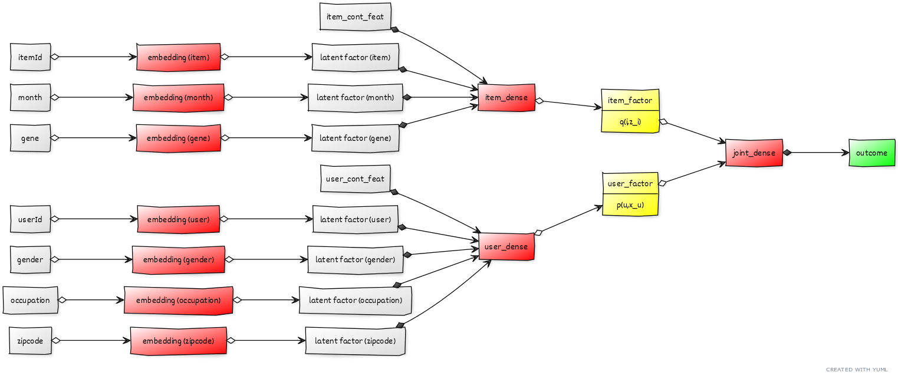

## The ID-only limit {.lesson-slide}

$$\widehat r_{ui}=p_u^\top q_i\quad\text{requires learned rows }p_u\text{ and }q_i$$

WARM START<b>Known user and item</b>
Both embeddings were learned from training interactions.

COLD START<b>New user or item</b>
No fitted row exists for that ID. The dot product alone has nothing to look up.

We need information that can be available <b>before</b> a new entity has ratings.

## Side information describes the entity {.lesson-slide}

USER<b>profile features</b>
For example, age group, stated interests, or a self-description.

ITEM<b>content features</b>
For example, film genre, release year, or a text description.

CONTEXT<b>event features</b>
For example, time or device, if known at prediction time.

A useful cold-start feature must exist when the recommendation is made. A rating-derived statistic may not.

## The prediction row is now richer {.lesson-slide}

user ID $u$ optional history
<i>+</i>
user features $x_u$
<i>+</i>
item ID $i$
<i>+</i>
item features $z_i$
<i>→</i>
rating $r_{ui}$

TRAIN<b>inputs and known rating</b>
Learn how IDs and features relate to ratings.

PREDICT<b>inputs, unknown rating</b>
Apply the same feature transformations to a new pair.

## Three ways to use the extra information {.lesson-slide}

FEATURES ONLY<b>$f(x_u,z_i)$</b>
Can handle new IDs, but may miss individual preferences.

ADD TO MF<b>$p_u^\top q_i+f(x_u,z_i)$</b>
Keep personalized ID factors and add a feature contribution.

SIDE-AWARE FACTORS<b>$p(u,x_u)^\top q(i,z_i)$</b>
Build each factor vector from ID and features together.

The third approach makes the interaction depend on the features on <b>both</b> sides.

## Numeric and categorical features enter differently {.lesson-slide}

NUMERIC<b>age, release year</b>
Pass a numerical value through a suitable transformation. Learn any scaling from training data only.

CATEGORICAL<b>genre, occupation</b>
Map each category to an integer lookup position, then learn an embedding for it.

$$\text{genre = comedy}\;\longrightarrow\;j\;\longrightarrow\;e_j\in\mathbb R^K$$

An ID is itself a categorical feature. The same embedding idea can represent other categories.

## A feature embedding is another learned table {.lesson-slide}

Suppose a film has one genre field with three possible values.

<table class="lesson-table"><thead><tr><th>category</th><th>encoded index</th><th>learned vector</th></tr></thead><tbody><tr><td>action</td><td>0</td><td>$e_0$</td></tr><tr><td>comedy</td><td>1</td><td>$e_1$</td></tr><tr><td>drama</td><td>2</td><td>$e_2$</td></tr></tbody></table>

The indices only select rows. The embedding coordinates are learned from the rating objective.

## A linear side-aware factor model {.lesson-slide}

$$p(u,x_u)=p_u+A x_u+e_{c(u)},\qquad q(i,z_i)=q_i+B z_i+e_{g(i)}$$

USER VECTOR<b>ID + numeric + category</b>
$p_u$ is personalized; $A x_u$ and $e_{c(u)}$ bring in user features.

ITEM VECTOR<b>ID + numeric + category</b>
$q_i$ is item-specific; $B z_i$ and $e_{g(i)}$ bring in item features.

$$\widehat r_{ui}=p(u,x_u)^\top q(i,z_i)$$

::: {.notes}
[Teaching] This is a compact teaching version of the linear side-aware architecture in the original deck. For a new ID, the ID-specific term needs an explicit zero/default policy; the feature terms can still be computed.
:::

## Four questions for the side-aware model {.lesson-slide}

1 · MODEL<b>factor vectors from IDs + features</b>
Predict with $p(u,x_u)^\top q(i,z_i)$.

2 · HYPERPARAMETERS<b>$K$ and regularization</b>
Choose factor width and shrinkage before fitting.

3 · CRITERION<b>rating error + penalty</b>
Minimize errors on training pairs, with a complexity control.

4 · LEARNED<b>embeddings + maps</b>
ID/category tables and feature maps $A,B$.

## The linear architecture as a network {.lesson-slide}

user ID + category + numeric features
<i>→</i>
ID/category lookups + $A x_u$
<i>→</i>
user factor $p(u,x_u)$

item ID + genre + numeric features
<i>→</i>
ID/category lookups + $B z_i$
<i>→</i>
item factor $q(i,z_i)$

$$\widehat r_{ui}=p(u,x_u)^\top q(i,z_i)$$

Numeric transformations and categorical lookups build the two factor vectors; their inner product predicts the rating.

## From linear maps to two towers {.lesson-slide}

USER TOWER<b>$h_u=F_u(u,x_u)$</b>
Combine user ID, numeric features, and category embeddings through a network.

ITEM TOWER<b>$h_i=F_i(i,z_i)$</b>
Do the same for item ID and content features.

$$\widehat r_{ui}=\rho(h_u,h_i)$$

Each tower can learn nonlinear <b>within-side</b> feature interactions before the two representations meet.

## Follow the two-tower computation {.lesson-slide}

The final interaction can be a dot product or a learned joint network. That choice changes the model family.

## What happens to a new user? {.lesson-slide}

new user ID <b>no fitted ID row</b>
<i>+</i>
available profile <b>$x_{\rm new}$</b>
<i>→</i>
user tower <b>$h_{\rm new}$</b>
<i>→</i>
item tower <b>$h_i$</b>
<i>→</i>
prediction

For cold start, the model must define how to handle the missing ID embedding. Side features can then supply a representation.

## Guard the validation boundary {.lesson-slide}

SAFE FEATURE<b>known before rating</b>
A film's genre or an already-available user profile can be used directly.

RATING-DERIVED FEATURE<b>mean, count, quantile</b>
Compute from the fitting fold only. A held-out rating must never help create its own input feature.

For each CV fold: split first → learn encodings and summaries on fitting rows → transform held-out rows → score.

::: {.notes}
[Source] scikit-learn's data leakage guidance: https://scikit-learn.org/stable/common_pitfalls.html . The original course deck lists rating means/counts as side information; their timing and fold boundary require special care.
:::

## Beyond tabular features {.lesson-slide}

TEXT<b>queries and reviews</b>
Convert content into numerical representations.

IMAGES<b>item photos</b>
Use visual encoders to build item features.

BEHAVIOR<b>interaction sequence</b>
Summarize recent actions to represent current interests.

Whatever the modality, ask whether its information is available when the prediction is made.

## Close the loop {.lesson-slide}

ID-only MF <b>personalization</b>
<i>→</i>
side-aware factors <b>metadata</b>
<i>→</i>
two towers <b>nonlinear representations</b>

Side information helps with cold start, but only a carefully specified fallback and a leakage-safe validation scheme make that benefit measurable.

