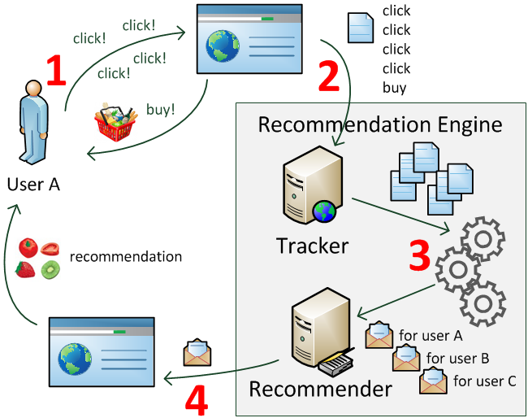
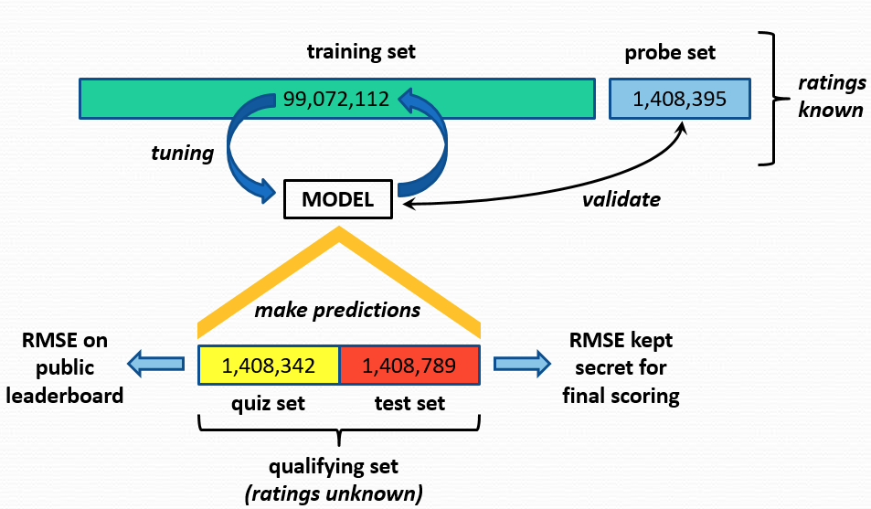
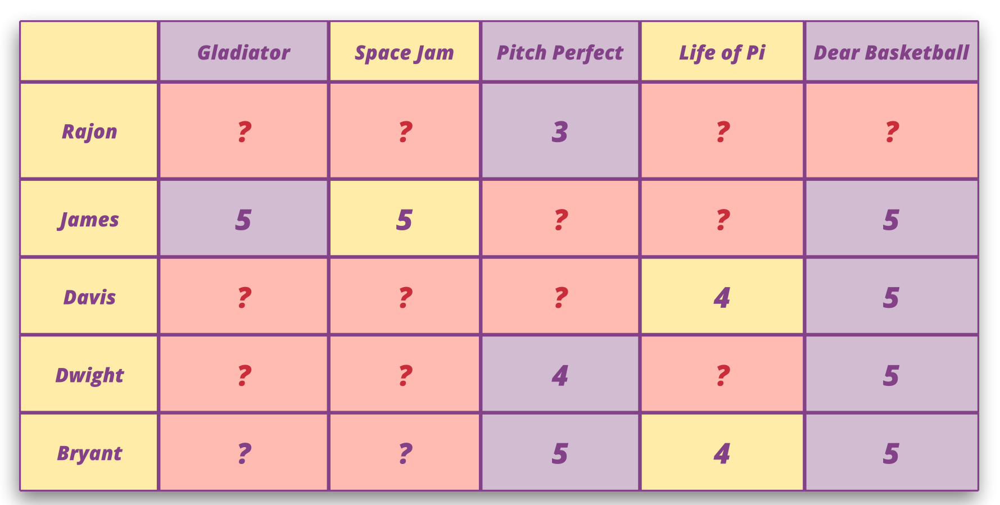
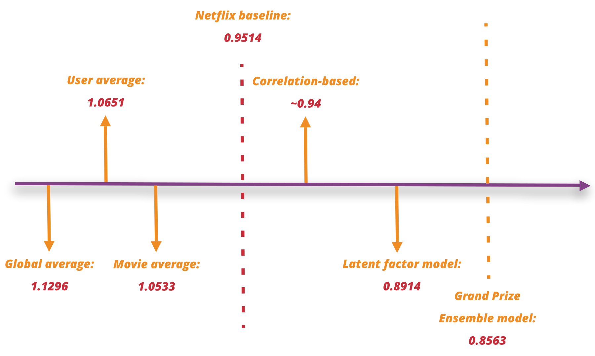

# Recommender Systems: An Overview

Recommender systems (RSs) are integral to platforms like Netflix, YouTube, Taobao, and Amazon. They suggest relevant items to users based on **historical data**, enhancing user experience and engagement.

  
*Source: [thedatascientist.com/right-way-recommender-system-startup](https://thedatascientist.com/right-way-recommender-system-startup)*

## Overview of Recommender Systems

  
*Source: [medium.com/voice-tech-podcast/a-simple-way-to-explain-the-recommendation-engine-in-ai-d1a609f59d97](https://medium.com/voice-tech-podcast/a-simple-way-to-explain-the-recommendation-engine-in-ai-d1a609f59d97)*

### Key Components:
- **Users:** Individuals who receive recommendations.
- **Items:** Products, movies, or content the system recommends.
- **Historical Data:** Past interactions between users and items.

## Advantages of Recommender Systems

1. **Revenue Increase:**  
   Successful RSs can lead to significant sales growth. For example, Amazon reported a **29% annual sales increase** due to effective recommendations [^1].

2. **User Satisfaction Increase:**  
   Personalized suggestions enhance user experience by understanding individual needs and preferences.

3. **Versatile Applications:**  
   Beyond e-commerce, RSs are used in:
   - Financial product recommendations.
   - Medical diagnosis suggestions.
   - Music and content streaming platforms.

**Conclusion:** Recommender systems are among the **most valuable applications** of Machine Learning (ML) today.

[^1]: [azati.ai/recommendation-systems-benefits-and-issues](https://azati.ai/recommendation-systems-benefits-and-issues/)

## Example: Netflix Prize

The **Netflix Prize Competition** was a landmark event in the field of recommender systems.

- **Participants:** 51,051 contestants from 41,305 teams across 186 countries.
- **Prize:** $1 million for a **10% improvement** in Netflix's recommendation accuracy.
  
### Competition Structure

  
*Source: [pantelis.github.io/cs301/docs/common/lectures/recommenders/netflix/](https://pantelis.github.io/cs301/docs/common/lectures/recommenders/netflix/)*

## Dataset: Netflix Prize

The Netflix Prize dataset is a rich source of information that has been widely used in the development and evaluation of recommender systems. It includes a vast amount of user-item interaction data, which serves as a foundation for building models that predict user preferences.

### Key Features

#### Training Dataset

The training dataset is composed of user ratings for movies, providing a comprehensive view of user preferences. Here are its key characteristics:

- **MovieIDs:** 
  - The dataset includes a range of **17,770 unique movie IDs**.
  - Each movie ID corresponds to a specific film in the Netflix catalog, allowing for easy identification and retrieval of movie details.

- **CustomerIDs:** 
  - There are **2,649,429 unique customer IDs**, representing the users who have rated movies.
  - This large number of users provides a diverse set of preferences, enhancing the robustness of any model trained on this data.

- **Ratings:** 
  - The dataset contains approximately **100 million ratings**, with each rating falling on a scale from **1 to 5**.
  - Ratings are typically sparse, meaning many users have not rated many movies. For example, a user may have rated only 20 out of the 17,770 movies available.

#### Testing Dataset

The testing dataset is structured similarly to the training dataset but is used to evaluate the performance of recommender systems. It contains:

- **MovieIDs and CustomerIDs:** 
  - The testing dataset includes pairs of MovieIDs and CustomerIDs for which the ratings are unknown, allowing for model evaluation based on predictions.

## Formal Model: Recommender Systems

### Definitions

- **User:** $u = 1, \ldots, n$ (where $n$ is the number of users).
- **Item:** $i = 1, \ldots, m$ (where $m$ is the number of items).
- **Rating:** $r_{ui}$ is the rating given by user $u$ for item $i$.
- **Observed Index Set:** $(u,i) \in \Omega$ if the rating for the pair $(u,i)$ is observed.

### Evaluation Metric

To assess the accuracy of predictions made by a recommender system, the **Root Mean Squared Error (RMSE)** is commonly used. RMSE measures the average deviation of predicted ratings from actual ratings, providing a clear indication of model performance. The formula for RMSE is:

$$
\text{RMSE} = \sqrt{\frac{1}{n_{te}} \sum_{i=1}^{n_{te}} (r_{i} - \hat{r}_{i})^2}
$$

Where:
- $r_{i}$ is the actual rating.
- $\hat{r}_{i}$ is the predicted rating.
- $n_{te}$ is the number of predictions.

### Example of RMSE Calculation

Suppose we have the following actual ratings and predicted ratings for three movies:

| (user, item) | Actual Rating ($r$) | Predicted Rating ($\hat{r}$) |
|---------|--------------------------|----------------------------------|
| (1,1)       | 4                        | 3.5                              |
| (1,2)       | 5                        | 4.8                              |
| (3,2)       | 2                        | 3                                |

To calculate RMSE:

1. Compute the squared differences:
   - For Record 1: \( (4 - 3.5)^2 = 0.25 \)
   - For Record 2: \( (5 - 4.8)^2 = 0.04 \)
   - For Record 3: \( (2 - 3)^2 = 1 \)

2. Average the squared differences:
   $$ 
   \text{Mean} = \frac{0.25 + 0.04 + 1}{3} = \frac{1.29}{3} \approx 0.43 
   $$

3. Take the square root:
   $$ 
   RMSE \approx \sqrt{0.43} \approx 0.66 
   $$

This RMSE value can then be used to compare different models or approaches to see which yields the most accurate predictions.

> **In-Class Demo:** The dataset can be loaded into a Python environment using libraries such as Pandas. Here’s a simple example of how to load the dataset:

### Note

A formal mathematical model is needed to define the recommender system problem, which will guide the development and evaluation of the algorithms used to predict user ratings based on historical data.

[^2]: [Kaggle Netflix Prize Data](https://www.kaggle.com/netflix-inc/netflix-prize-data)

## Methods: Netflix Prize

### Course Coverage
- We will explore various methods for building recommender systems, including collaborative filtering, content-based filtering, and hybrid approaches.

Here's an expanded version of the section on baseline methods for recommender systems, including additional explanations, examples, and a clearer layout.

Certainly! Here’s the revised version of the baseline methods section, using single dollar signs for inline math notations and double dollar signs for block equations.

## Baseline Methods: Recommender Systems

Baseline methods serve as simple yet effective strategies for making recommendations. These methods provide a benchmark against which more complex models can be evaluated. Below, we detail several baseline methods commonly used in recommender systems.

### 1. Global Average

The global average method predicts new ratings by calculating the average of all observed ratings in the dataset. This approach assumes that the average rating is a reasonable estimate for any unseen item.

#### Formula

The global average rating $\bar{r}$ is calculated as follows:

$$
\bar{r} = \frac{1}{|\Omega|} \sum_{(u,i) \in \Omega} r_{ui}
$$

Where:
- $|\Omega|$ is the total number of observed ratings.
- $r_{ui}$ is the rating given by user $u$ for item $i$.
- The predicted rating for any user-item pair is $\hat{r}_{ui} = \bar{r}$.

#### Example Calculation

Suppose we have the following ratings from multiple users:

| UserID | MovieID | Rating ($r$) |
|--------|---------|--------------|
| 1      | 1       | 4            |
| 1      | 2       | 5            |
| 2      | 1       | 3            |
| 2      | 3       | 4            |
| 3      | 2       | 2            |
| 3      | 3       | 5            |

To calculate the global average rating:

1. **Sum the Ratings:**
   $$
   \text{Total Ratings} = 4 + 5 + 3 + 4 + 2 + 5 = 23
   $$

2. **Count the Ratings:**
   $$
   |\Omega| = 6 \quad (\text{total number of ratings})
   $$

3. **Calculate the Global Average:**
   $$
   \bar{r} = \frac{23}{6} \approx 3.83
   $$

4. **Predicted Rating:**
   For any user-item pair, the predicted rating $\hat{r}_{ui}$ is approximately 3.83.

#### Advantages and Disadvantages

- **Advantages:**
  - Simple to implement and computationally efficient.
  - Provides a baseline performance metric for more complex models.

- **Disadvantages:**
  - Does not account for individual user preferences or item characteristics.
  - May not perform well in datasets with significant variability in ratings.

### User Average

The user average method predicts a user's rating for an unseen item based on their average rating of items they have previously rated.

#### Formula

The user average rating $\bar{r}_u$ is calculated as follows:

$$
\bar{r}_u = \frac{1}{|\mathcal{I}_u|} \sum_{i \in \mathcal{I}_u} r_{ui}
$$

Where:
- $|\mathcal{I}_u|$ is the number of items rated by user $u$.
- $\mathcal{I}_u$ is the set of items rated by user $u$.
- The predicted rating for an unseen item is $\hat{r}_{ui} = \bar{r}_u$.

Here's a detailed example calculation for predicting ratings using the user average method, incorporating multiple user-item pairs:

---

### Example Calculation for User Average

For **User 1**, the ratings are:

| MovieID | Rating ($r$) |
|---------|--------------|
| 1       | 4            |
| 2       | 5            |

1. **Sum the Ratings:**
   $$
   \text{Total Ratings for User 1} = 4 + 5 = 9
   $$

2. **Count the Ratings:**
   $$
   |\mathcal{I}_1| = 2 \quad (\text{number of movies rated by User 1})
   $$

3. **Calculate the User Average:**
   $$
   \bar{r}_1 = \frac{9}{2} = 4.5
   $$

4. **Predicted Rating for Unseen Movies:**
   For any unseen movie, such as **Movie 3**, the predicted rating for User 1 is:
   $$
   \hat{r}_{13} \approx 4.5
   $$

### Predictions for Multiple User-Item Pairs

Now, let’s calculate the predicted ratings for multiple user-item pairs using the user averages for all users.

Suppose we have the following ratings from multiple users:

| UserID | MovieID | Rating ($r$) |
|--------|---------|--------------|
| 1      | 1       | 4            |
| 1      | 2       | 5            |
| 2      | 1       | 3            |
| 2      | 3       | 4            |
| 3      | 2       | 2            |
| 3      | 3       | 5            |

**Calculating User Averages:**

1. **For User 2:**
   - Ratings: Movie 1 (3), Movie 3 (4)
   - Sum: \(3 + 4 = 7\)
   - Count: $|\mathcal{I}_2| = 2$
   - Average: 
   $$
   \bar{r}_2 = \frac{7}{2} = 3.5
   $$

2. **For User 3:**
   - Ratings: Movie 2 (2), Movie 3 (5)
   - Sum: \(2 + 5 = 7\)
   - Count: $|\mathcal{I}_3| = 2$
   - Average: 
   $$
   \bar{r}_3 = \frac{7}{2} = 3.5
   $$

### Predicted Ratings for Unseen Movies

Using the user averages, we can predict ratings for various unseen movies:

- For **User 1** and **Movie 3**:
  $$
  \hat{r}_{13} \approx 4.5
  $$

- For **User 2** and **Movie 2**:
  $$
  \hat{r}_{22} \approx 3.5
  $$

- For **User 3** and **Movie 1**:
  $$
  \hat{r}_{31} \approx 3.5
  $$

This means that if User 1 were to watch Movie 3, the model predicts they would rate it approximately **4.5** based on their previous ratings. Similarly, predictions for User 2 and User 3 for their unseen movies are **3.5**.

#### Advantages and Disadvantages

- **Advantages:**
  - Takes into account individual user preferences.
  - More personalized than the global average method.

- **Disadvantages:**
  - Still does not consider the popularity of items or the ratings given by other users.
  - May not work well for users with very few ratings.

Here’s the content for the Item Mean-based method, structured similarly to the User Average method you provided.

---

### Item Average

The Item Average method predicts a user's rating for an unseen item based on the average rating of that item across all users. This method is particularly useful when items have been rated by multiple users, allowing the system to leverage collective feedback.

#### Formula

The item average rating $\bar{r}_i$ is calculated as follows:

$$
\bar{r}_i = \frac{1}{|\mathcal{U}_i|} \sum_{u \in \mathcal{U}_i} r_{ui}
$$

Where:
- $|\mathcal{U}_i|$ is the number of users who rated item $i$.
- $\mathcal{U}_i$ is the set of users who rated item $i$.
- The predicted rating for a user $u$ on an unseen item $i$ is $\hat{r}_{ui} = \bar{r}_i$.

### Example Calculation for Item Average

Suppose we have the following ratings from multiple users:

| UserID | MovieID | Rating ($r$) |
|--------|---------|--------------|
| 1      | 1       | 4            |
| 1      | 2       | 5            |
| 2      | 1       | 3            |
| 2      | 3       | 4            |
| 3      | 2       | 2            |
| 3      | 3       | 5            |

#### Step 1: Calculate the Mean Rating for Each Item

1. **For Movie 1:**
   - Ratings: 4 (User 1), 3 (User 2)
   - Sum: 
   $$
   4 + 3 = 7
   $$
   - Count: 
   $$
   |\mathcal{U}_1| = 2 \quad (\text{number of users who rated Movie 1})
   $$
   - Mean:
   $$
   \bar{r}_1 = \frac{7}{2} = 3.5
   $$

2. **For Movie 2:**
   - Ratings: 5 (User 1), 2 (User 3)
   - Sum: 
   $$
   5 + 2 = 7
   $$
   - Count: 
   $$
   |\mathcal{U}_2| = 2 \quad (\text{number of users who rated Movie 2})
   $$
   - Mean:
   $$
   \bar{r}_2 = \frac{7}{2} = 3.5
   $$

3. **For Movie 3:**
   - Ratings: 4 (User 2), 5 (User 3)
   - Sum: 
   $$
   4 + 5 = 9
   $$
   - Count: 
   $$
   |\mathcal{U}_3| = 2 \quad (\text{number of users who rated Movie 3})
   $$
   - Mean:
   $$
   \bar{r}_3 = \frac{9}{2} = 4.5
   $$

### Predictions for Unseen Movies

Using the item averages, we can predict ratings for various unseen movies:

- For **User 1** and **Movie 3**:
  - The predicted rating for User 1 is:
  $$
  \hat{r}_{13} \approx 4.5
  $$

- For **User 2** and **Movie 2**:
  - The predicted rating for User 2 is:
  $$
  \hat{r}_{22} \approx 3.5
  $$

- For **User 3** and **Movie 1**:
  - The predicted rating for User 3 is:
  $$
  \hat{r}_{31} \approx 3.5
  $$

This means that if User 1 were to watch Movie 3, the model predicts they would rate it approximately **4.5** based on the average rating of that movie from all users. Similarly, predictions for User 2 and User 3 for their unseen movies are **3.5**.

#### Advantages and Disadvantages

- **Advantages:**
  - Utilizes the collective opinion of all users, providing a more generalized prediction.
  - Effective for items that have been rated by many users, ensuring reliability in the average.

- **Disadvantages:**
  - Does not account for individual user preferences, which may lead to less personalized recommendations.
  - May not be effective for items with very few ratings, as the average may not be representative.

### Conclusion

Baseline methods like the global average and user average provide a foundational understanding of how to approach the recommender system problem. They are essential for establishing benchmarks and can be improved upon with more sophisticated techniques, such as collaborative filtering or hybrid models.
